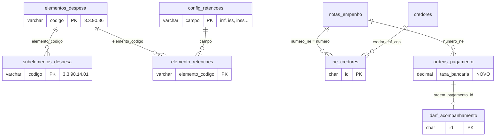

# Arquitetura — Projeto Retenções v2

> Documento de desenho. Nada aqui foi implementado. Referência de código: commit `006d34c`.

## 1. Estado atual (resumo do que foi lido no código)

| Tema | Como é hoje | Onde |
|---|---|---|
| Alíquotas | Fixas em **dois lugares**: formulário (`0.015`, `0.05`, `0.11`, `0.025`, `0.20`) e servidor (bloco `perfil !== 'ADMIN'`) | `components/op-form/OpTaxesSection.tsx`, `lib/services/ordem-pagamento.service.ts` (`criar` e `atualizar`) |
| Quais impostos aplicar | Todos os 5 marcados para qualquer elemento; só o ADMIN edita; o servidor usa "valor > 0" como indício de que o imposto estava marcado (um cliente pode enviar 0 e pular um imposto) | idem |
| Arredondamento | `Math.round(x*100)/100` e `maskCurrency(vp*0.015)` (ponto flutuante). Ex.: 11,00 × 1,5% = 0,165 vira **0,16** | `OpTaxesSection.tsx`, `lib/utils.ts` |
| Elemento/Subelemento | Duas listas soltas em `lib/constants.ts` (`ELEMENTOS`, `SUBELEMENTOS`), sem vínculo entre si; gravados como texto | `app/notas-empenho/page.tsx`; na OP vêm da NE (`OpPaymentData.tsx`) |
| NE × credor | A NE guarda **um** credor (`credor_nome`, `cpf_cnpj`); a OP guarda o credor próprio (FK `fk_op_credor`) | `notas_empenho`, `ordens_pagamento` |
| Número da OP | Gerado só ao salvar: `numero_empenho` guarda o **número da OP** (`2026.OP.0001`), `numero_ne` guarda a NE, `sub` o sub-empenho (`01`, `02`…), com `FOR UPDATE` e até 5 tentativas | `OrdemPagamentoService.criar` |
| Exclusão de OP | `DELETE` físico, com registro em `auditoria_financeira` | `OrdemPagamentoService.excluir` |
| Impressão | Rótulos fixos: "IRRF (1,5%)", "ISS (5%)", "INSS (11%)", "PATRONAL (20%)", "SEST/SENAT (2,5%)" | `components/consulta-impressao/ReciboVia.tsx` |
| Perfis | `ADMIN`, `GESTOR`, `CONSULTA` (o `lib/store.ts` ainda tipa `'USER'`: inconsistência) | `usuario.service.ts`, `lib/store.ts` |
| Município | O credor já tem `cidade` + `uf` (rótulo "Município"), preenchidos por consulta de CNPJ/CEP | `credores`, `app/credores/page.tsx` |

## 2. Princípios de desenho

1. **O servidor é a autoridade.** O formulário só exibe e sugere; o servidor recalcula retenções a partir da configuração do banco e do elemento da NE (não confia em valores enviados, exceto campos que o admin liberou).
2. **Uma única implementação de cálculo**, em código puro (`lib/money.ts` + `lib/retencoes.ts`), usada pelo servidor, pelo formulário, pela tela do admin (simulador) e pelos testes.
3. **Configuração em tabelas, não em constantes.** Alíquotas, flags e matriz elemento×imposto vivem no banco e o admin as edita.
4. **Compatível com o banco compartilhado:** somente tabelas novas e colunas novas com `DEFAULT`; colunas legadas continuam sendo gravadas.
5. **Dinheiro em centavos inteiros** dentro do motor de cálculo; conversão para `DECIMAL(15,2)` só na borda.
6. **Auditável:** mudanças de configuração e de status da DARF entram em `auditoria_financeira`; cada OP guarda o snapshot das alíquotas usadas.

## 3. Modelo de dados proposto



### Tabelas novas

| Tabela | Finalidade | Task |
|---|---|---|
| `elementos_despesa` | Cadastro de elementos (código, descrição, ativo, legado, ordem) | T02 |
| `subelementos_despesa` | Subelementos ligados ao elemento (`3.3.90.14.01`…) | T02 |
| `config_retencoes` | Uma linha por campo de *Retenções e Descontos*: tipo, alíquota, automático, editável pelo operador, entra na DARF, ativo | T03 |
| `elemento_retencoes` | Matriz elemento × imposto: quais impostos se aplicam | T03 |
| `ne_credores` | Credores de uma NE com o valor bruto de cada um | T14 |
| `darf_acompanhamento` | Uma linha por OP que tem DARF, com competência e status | T19 |

### Colunas novas em `ordens_pagamento` (T09)

`taxa_bancaria DECIMAL(10,2) NOT NULL DEFAULT 0`, `taxa_pix DECIMAL(10,2) NOT NULL DEFAULT 0` e `retencoes_snapshot JSON NULL` (alíquotas e regras usadas no cálculo).

## 4. Motor de cálculo

### 4.1 Arredondamento (R1)

Regra: **olhar o 3º decimal; 5 ou mais sobe**. Para valores não negativos isso é equivalente ao "meio para cima" clássico (9,9749 → 9,97; 9,975 → 9,98).

Implementação (T01), sem depender de ponto flutuante:

```
calcPercentCents(baseCents, aliquotaPercent):
  aliq = round(aliquotaPercent * 10_000)            // 1,5 -> 15000 (4 casas decimais de %)
  return floor( (baseCents * aliq + 500_000) / 1_000_000 )   // BigInt para evitar overflow
```

`arredondarMoeda(x: number)` (para valores já em ponto flutuante): `x.toFixed(10)` elimina o ruído binário (9,975 → "9.9750000000") e a regra do 3º decimal é aplicada sobre a *string*.

### 4.2 Retenções (T10)

Entradas: bruto da OP (centavos), código do elemento, configuração (`config_retencoes`), matriz (`elemento_retencoes`), valores informados pelo operador e o perfil.

```
para cada campo tributário (irrf, iss, inss, patronal, sest_senat):
  se !config[campo].ativo                       -> 0
  se !matriz[elemento][campo]                   -> 0   (ex.: .14 não tem imposto)
  se config[campo].calculo_automatico           -> calcPercentCents(bruto, aliquota)
  senão                                         -> valor informado (digitado)
  se (config[campo].editavel_operador || perfil == ADMIN) e valor informado presente
                                                -> usa o informado (validado: 0 <= v <= bruto)
para campos de desconto (outros, taxa_bancaria, taxa_pix):
  não dependem do elemento; usam o valor informado (se o campo estiver ativo e permitido)
total_descontos = soma dos centavos
liquido        = bruto - total_descontos          (erro 422 se total > bruto)
```

Saída: valores em centavos, total, líquido, avisos e `snapshot` (alíquotas/flags usadas).

### 4.3 Fonte do elemento

O servidor lê o `elemento` **da NE** (já é consultada com `FOR UPDATE` dentro da transação) e extrai o código com `extrairCodigoElemento("3.3.90.36 - Outros Serviços…") → "3.3.90.36"`. O valor enviado pelo cliente é ignorado para decidir regras.

## 5. Contratos de API (novos e alterados)

| Método e rota | Perfis | Descrição | Task |
|---|---|---|---|
| `GET /api/elementos` | todos | Elementos ativos com subelementos e matriz de retenções | T04 |
| `POST/PUT/DELETE /api/elementos[/codigo]` e `/api/subelementos` | ADMIN | CRUD (DELETE = `ativo=0`) | T04 |
| `GET /api/configuracoes/retencoes` | todos | Campos + matriz. `Cache-Control: no-store` | T06 |
| `PUT /api/configuracoes/retencoes` | **ADMIN** | Salva campos e matriz numa transação, com auditoria | T06 |
| `GET /api/ordens-pagamento/proximo-numero?numeroNe=…` | ADMIN, GESTOR | `{ numeroOp, sub, rotulo, previsto: true }` | T13 |
| `POST/PUT /api/ordens-pagamento` | ADMIN, GESTOR | Passa a aceitar `taxaBancaria`, `taxaPix`; devolve `numeroOp` e `sub` definitivos | T10, T13 |
| `POST/PUT /api/notas-empenho` | ADMIN, GESTOR | Aceita `credores: [{ cpfCnpj, valorBruto }]` (opcional, retrocompatível) | T15 |
| `GET /api/notas-empenho[?busca]` e por número | todos | Devolve `credores` com `valorBruto`, `valorPago`, `saldo` | T15 |
| `GET /api/darf` | todos | Lista/agrupa por competência, status e credor, com totais | T20 |
| `POST /api/darf/status` | ADMIN, GESTOR | Marca `PAGA`/`PENDENTE` em lote, com data e observação | T20 |

Padrão de erro: o mesmo já usado (`withErrorHandler`, `{ error }` e códigos 400/401/403/404/409/422).

## 6. Fluxos principais

### 6.1 Criar OP (depois do projeto)

```mermaid
sequenceDiagram
  participant U as Operador
  participant F as Formulário OP
  participant A as API /ordens-pagamento
  participant S as OrdemPagamentoService
  participant DB as MySQL
  U->>F: escolhe NE (e credor da NE)
  F->>A: GET proximo-numero (previsão)
  F->>F: calcularRetencoes(config, elemento) -> sugere valores
  U->>F: informa taxa bancária / PIX
  F->>A: POST OP
  A->>S: criar()
  S->>DB: BEGIN; trava NE + ne_credores; lê config e elemento
  S->>S: calcularRetencoes() (autoridade)
  S->>DB: INSERT ordens_pagamento (+ snapshot)
  S->>DB: UPSERT darf_acompanhamento (se houver DARF)
  S->>DB: UPDATE status da NE; auditoria; COMMIT
  S-->>F: numeroOp e sub definitivos
```

### 6.2 Alterar alíquota (admin)

`PUT /api/configuracoes/retencoes` → transação grava `config_retencoes`/`elemento_retencoes` + auditoria → próxima leitura (`GET`, que não usa cache) já traz os valores novos → qualquer OP **criada ou recalculada depois** usa a regra nova. OPs já gravadas **não mudam** (D12) e guardam o snapshot do que foi usado.

### 6.3 NE com vários credores

Usuário escolhe os credores e digita o bruto de cada um → a tela mostra "Soma × Valor da NE" e só libera "Salvar" quando a diferença é **zero centavos** → o servidor valida de novo (soma em centavos) e grava `ne_credores` + colunas legadas (primeiro credor). Na OP, o operador escolhe o credor da NE; o limite do pagamento é o **bruto restante daquele credor** (bruto − OPs já emitidas), além do saldo da NE.

## 7. Permissões

| Ação | ADMIN | GESTOR | CONSULTA |
|---|:-:|:-:|:-:|
| Ver retenções, elementos, DARF | ✔ | ✔ | ✔ |
| Editar configuração de retenções/elementos | ✔ | – | – |
| Criar/editar NE e OP | ✔ | ✔ | – |
| Editar valores de retenção direto na OP | ✔ | só campos liberados (`editavel_operador`) | – |
| Marcar DARF como paga | ✔ | ✔ | – |

## 8. Concorrência e consistência

- Número da OP: continua com `FOR UPDATE` + `UNIQUE` + retry (já existe). A previsão da T13 **não reserva** número.
- `ne_credores` e `ordens_pagamento` da mesma NE são travadas na transação (`SELECT … FOR UPDATE`) para evitar estourar o bruto do credor ou o saldo da NE.
- A DARF é sincronizada **na mesma transação** da OP (criar/editar/excluir), evitando divergência.

## 9. Estratégia de banco e deploy

1. Migrations `10` a `14` rodam no Workbench, em **homologação primeiro**, sempre antes do deploy do código.
2. Cada script é idempotente e termina com `INSERT IGNORE INTO schema_migrations`.
3. Seeds são conferidos pelo usuário antes de ir para produção (matriz de retenções e alíquotas).
4. Rollback: blocos comentados; qualquer `DROP` só com aprovação explícita.

## 10. Alternativas descartadas

| Alternativa | Por que não |
|---|---|
| Guardar a matriz de impostos em JSON numa linha de configuração | Difícil de auditar, validar e consultar; tabela `elemento_retencoes` é simples e indexável |
| Manter o cálculo no navegador e só validar no servidor | Foi a origem do desvio atual; o servidor precisa ser a autoridade |
| Alterar `notas_empenho` para guardar vários credores em JSON | Quebraria os outros sistemas e dificultaria o limite por credor; tabela `ne_credores` é mais segura |
| Criar o status da DARF como colunas em `ordens_pagamento` | Mistura responsabilidade e exige `ALTER` em tabela compartilhada; tabela própria é mais limpa |
| Renomear `numero_empenho` (que guarda o nº da OP) | Banco compartilhado; só documentar |
