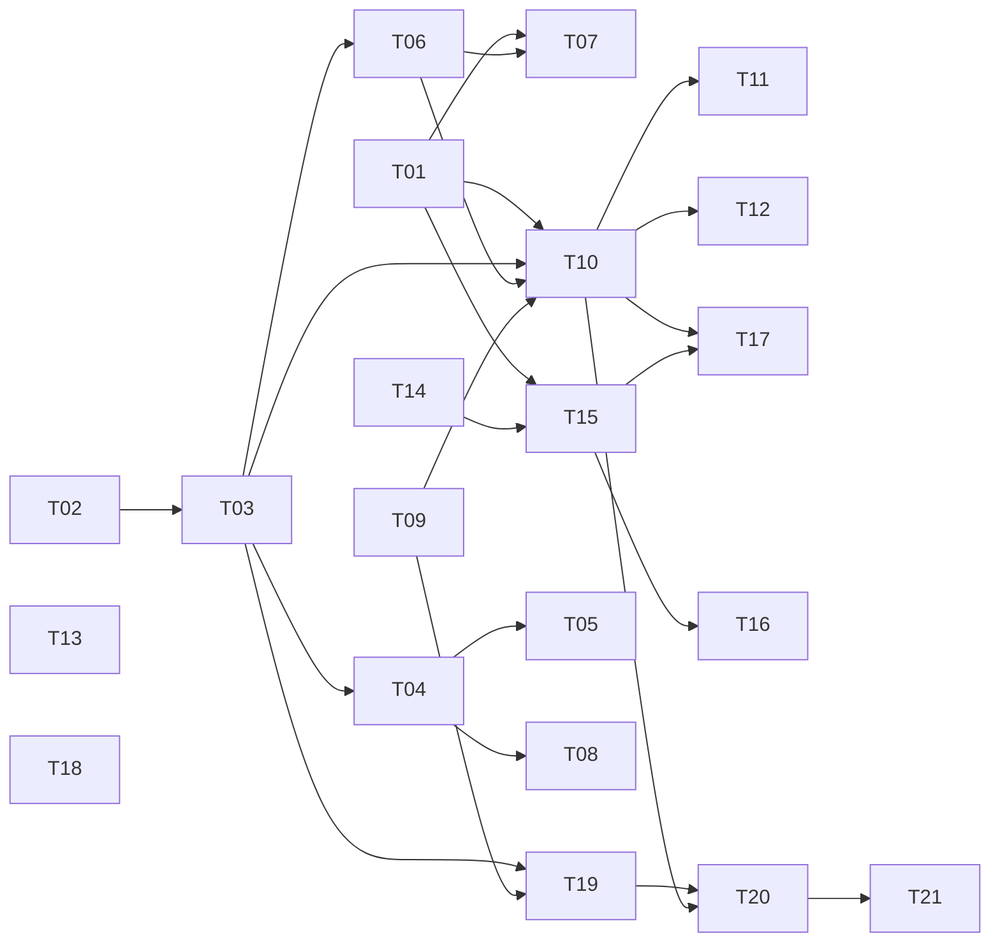

# Projeto Retenções v2 — Plano de Implementação

> **Status:** PLANEJAMENTO. Nenhum código, banco ou configuração foi alterado.
> **Base analisada:** `main` no commit `006d34c` (06/10/2026).
> **Escopo:** retenções por elemento, tela de administração das taxas, taxas bancária/PIX, NE com vários credores, número previsto da OP, município do credor, status da DARF e novos elementos/subelementos.

Este documento é o ponto de entrada. Os detalhes técnicos estão em [`ARQUITETURA.md`](./ARQUITETURA.md) e cada entrega está descrita em um arquivo de [`tasks/`](./tasks).

---

## 1. Objetivo

Hoje o formulário da Ordem de Pagamento (OP) marca **todos** os impostos para **qualquer** elemento de despesa, com alíquotas fixas no código (IRRF 1,5%, ISS 5%, INSS 11%, SEST/SENAT 2,5%, Patronal 20%), e o cálculo usa ponto flutuante, o que erra centavos em alguns casos. A NE aceita um único credor, não há controle da DARF e a tela não mostra qual será o número da OP.

O projeto muda isso para:

- as **regras de retenção dependerem do elemento** escolhido;
- as **taxas serem definidas pelo administrador** em uma tela e valerem para todos os usuários;
- o **arredondamento** seguir a regra oficial (3º decimal ≥ 5 arredonda para cima);
- a NE aceitar **vários credores**, com valor bruto por credor fechando com o valor da NE;
- existir uma **tela de status da DARF**.

## 2. Origem dos requisitos

Anotações manuscritas do usuário (4 fotos: tabela de elementos com marcações, "Ideias para o sistema", página da dízima e o elemento 3.3.90.47) e três rodadas de esclarecimento por conversa. As anotações originais **não** foram incluídas no repositório; o que importa foi transcrito aqui.

## 3. Requisitos (rastreabilidade)

| ID | Requisito | Tasks |
|----|-----------|-------|
| R1 | Arredondamento: se o 3º decimal for 5 ou mais, o valor sobe (ex.: 9,975 → 9,98) | T01, T10 |
| R2 | Campos **Taxa bancária (expediente)** e **Taxa PIX** em *Retenções e Descontos*, digitados na hora | T09, T10, T11, T12 |
| R3 | Retenções dependem do elemento (.33/.36/.39/.30/.47 têm as mesmas taxas, exceto ISS; .14 é sem imposto; DARF 11%) | T02, T03, T04, T05, T10, T11 |
| R4 | Tela do **ADMIN** para editar **todos** os campos de retenções e descontos; vale para todos os usuários | T03, T06, T07 |
| R5 | Em caso específico, o admin pode **habilitar alteração manual** | T03, T06, T07, T10, T11 |
| R6 | Tela de status separada com **todos os credores que tiverem DARF** | T19, T20, T21 |
| R7 | Vários credores em uma NE; usuário informa o **bruto** de cada um; soma dos brutos = valor da NE | T14, T15, T16, T17 |
| R8 | Salvar o **município** no credor | T18 |
| R9 | Na OP, mostrar qual número será (NE …/01 ou /02 e nº da OP) | T13 |
| R10 | Novos elementos e subelementos, em cascata | T02, T04, T05, T08 |

### Fora do escopo (ADIADO por decisão do usuário)

- ISS com taxas e multas;
- lembrete de DAE não gerado;
- salvar empenhos automaticamente;
- importar planilha de cálculo base para gerar empenhos.

> A tabela `ne_credores` (T14) já deixa a base pronta para a importação de planilha no futuro.

## 4. Decisões fechadas

1. Elementos `.33`, `.36`, `.39`, `.30` e `.47` têm o mesmo conjunto de retenções (IR, INSS 11%, Patronal, SEST/SENAT); o **ISS é a exceção** (ver D1).
2. `3.3.90.14` (subelementos `.01` e `.03`) é **sem nenhum imposto**.
3. DARF = INSS 11% + Patronal + SEST + SENAT.
4. Taxa bancária (expediente) e taxa PIX são **valores digitados na hora**, sem valor fixo.
5. O admin edita **todos** os campos de retenções e descontos em uma tela; a mudança vale para **todos os usuários**.
6. A **soma dos brutos tem que fechar exatamente** com o valor da NE.
7. A tela de DARF lista **todos** os credores que tiverem DARF, em tela separada.
8. Arredondamento: olhar o 3º decimal; 5 ou mais sobe.

## 5. Decisões em aberto (as tasks já assumem a coluna "Suposição")

| ID | Pergunta | Suposição adotada | Afeta |
|----|----------|-------------------|-------|
| D1 | **ISS**: valor digitado pelo operador em cada OP, ou percentual padrão do admin? | Seed: ISS **aplica** em .33/.36/.39 e **não** em .30/.47 (é o que as anotações marcam), com 5% automático. O admin pode trocar para "digitado" sem mexer em código. | T03, T06, T10 |
| D2 | O que é "habilitar alteração em caso específico"? | Flag **por campo** `editavel_operador` na tela do admin. O ADMIN continua podendo editar direto na OP (comportamento atual). | T06, T07, T10, T11 |
| D3 | Elementos antigos (3.3.90.32, .35, .40, 4.4.90.51, .52): continuam? | Continuam ativos, marcados como "legado", com as retenções do comportamento atual (todas as 5). Admin revisa. | T02, T03 |
| D4 | Quais campos entram na DARF? | INSS, Patronal e SEST/SENAT. **IRRF e ISS ficam fora.** | T03, T19, T20 |
| D5 | Estados do status da DARF | `PENDENTE` e `PAGA` (coluna é VARCHAR para permitir outros depois). | T19–T21 |
| D6 | Mês de competência da DARF | `data_pagamento` da OP, com fallback para `data_emissao`. | T19, T20 |
| D7 | NE com vários credores: o que vai nas colunas legadas `credor_nome`/`cpf_cnpj`? | O **primeiro** credor; `ne_credores` é a fonte da verdade. | T15 |
| D8 | O elemento `3.3.90.47` (obrigações tributárias) realmente leva as mesmas retenções? | Sim, como foi dito (sem ISS). Confirmar, pois é o elemento das guias. | T03 |
| D9 | Subelementos dos demais elementos | Não há lista oficial; o campo fica opcional quando o elemento não tiver subelementos cadastrados. Valores antigos continuam exibidos. | T05, T08 |
| D10 | Município do credor é obrigatório? | Não. Normalizado (trim) e sempre exibido. | T18 |
| D11 | Taxas bancária e PIX saem do líquido do credor? | Sim, entram em "Total de Descontos". | T10, T12 |
| D12 | Ao **editar** uma OP antiga com a config nova | Recalcula só se `valorPagamento`, elemento ou credor mudarem; senão preserva os valores gravados. | T10 |
| D13 | OP com DARF já paga pode ser editada/excluída? | Não: bloqueia alteração de valores e exclusão (HTTP 409). | T20 |

## 6. Matriz de retenções (seed inicial, editável pelo admin)

| Elemento | IRRF | ISS | INSS 11% | Patronal | SEST/SENAT | Observação |
|---|:-:|:-:|:-:|:-:|:-:|---|
| 3.3.90.14 (e .14.01, .14.03) | – | – | – | – | – | **Sem imposto** |
| 3.3.90.30 | ✔ | – | ✔ | ✔ | ✔ | |
| 3.3.90.33 | ✔ | ✔ | ✔ | ✔ | ✔ | |
| 3.3.90.36 | ✔ | ✔ | ✔ | ✔ | ✔ | |
| 3.3.90.39 | ✔ | ✔ | ✔ | ✔ | ✔ | |
| 3.3.90.47 | ✔ | – | ✔ | ✔ | ✔ | confirmar (D8) |
| Legados (32, 35, 40, 4.4.90.51/.52) | ✔ | ✔ | ✔ | ✔ | ✔ | comportamento atual (D3) |

Taxa bancária, Taxa PIX e "Outros" **não** dependem do elemento: aplicam-se a qualquer OP.

## 7. Exemplos numéricos de referência (viram casos de teste)

Alíquotas seed: IRRF 1,5% · ISS 5% · INSS 11% · Patronal 20% · SEST/SENAT 2,5%.

| Caso | Bruto | Elemento | Resultado esperado |
|---|---:|---|---|
| A | 1.000,00 | .36 | IRRF 15,00 · ISS 50,00 · INSS 110,00 · Patronal 200,00 · SEST/SENAT 25,00 → desc. 400,00 → **líquido 600,00** |
| B | 665,00 | .36 | IRRF **9,98** (9,975 sobe) · ISS 33,25 · INSS 73,15 · Patronal 133,00 · SEST/SENAT **16,63** (16,625 sobe) → desc. 266,01 → **líquido 398,99** |
| C | 1.000,00 | .30 | IRRF 15,00 · INSS 110,00 · Patronal 200,00 · SEST/SENAT 25,00 (sem ISS) → desc. 350,00 → **líquido 650,00** |
| D | 1.000,00 | .14.01 | nenhuma retenção → **líquido 1.000,00** |
| E | 665,00 | .36 + taxa bancária 8,50 | desc. 274,51 → **líquido 390,49** |
| F | 11,00 | .36 | IRRF 0,165 → **0,17** (hoje o sistema grava 0,16: bug de ponto flutuante) |

## 8. Regras críticas do repositório (herdadas de `contexto_sessao_atual.md`)

1. O schema `empenho` é **compartilhado com outras aplicações em produção**. **Nunca** `DROP COLUMN` / `DROP TABLE`. Só `CREATE TABLE IF NOT EXISTS` e `ADD COLUMN`/`MODIFY` não destrutivos.
2. Scripts SQL são **executados manualmente no MySQL Workbench** por conta privilegiada (o usuário `admin` do app não tem `ALTER` nem `REFERENCES`). Todo script começa com `USE empenho; SET SQL_SAFE_UPDATES = 0;` e registra a versão em `schema_migrations`.
3. **Nada de `commit`/`push`** sem o usuário pedir.
4. Colunas legadas (`elemento_subelemento`, `credor_nome`, `cpf_cnpj`, `total_descontos`…) **continuam sendo gravadas** para não quebrar os outros sistemas.
5. Antes de abrir PR: `npm run lint:types`, `npm run lint`, `npm test` e `npm run build` (é o que o CI roda).

## 9. Mapa de tasks

| ID | Título | Fase | Prior. | Estim.* | Depende de |
|----|--------|------|:-:|--:|------------|
| [T01](./tasks/TASK-01-arredondamento-monetario.md) | Função única de arredondamento monetário | 0 Fundação | P0 | 4 h | – |
| [T02](./tasks/TASK-02-migration-10-elementos.md) | Migration 10 — elementos e subelementos | 1 Banco | P0 | 3 h | – |
| [T03](./tasks/TASK-03-migration-11-config-retencoes.md) | Migration 11 — config de retenções e regras por elemento | 1 Banco | P0 | 4 h | T02 |
| [T04](./tasks/TASK-04-api-elementos.md) | Serviço e API de elementos/subelementos | 2 Elementos | P1 | 6 h | T02, T03 |
| [T05](./tasks/TASK-05-cascata-elemento-subelemento.md) | Cascata elemento→subelemento nas telas | 2 Elementos | P1 | 6 h | T04 |
| [T06](./tasks/TASK-06-api-config-retencoes.md) | Serviço e API de configuração de retenções | 3 Config admin | P1 | 6 h | T03 |
| [T07](./tasks/TASK-07-tela-admin-retencoes.md) | Tela do admin — Retenções e Descontos | 3 Config admin | P1 | 10 h | T06, T01 |
| [T08](./tasks/TASK-08-tela-admin-elementos.md) | (Opcional) Tela do admin — elementos/subelementos | 3 Config admin | P3 | 8 h | T04 |
| [T09](./tasks/TASK-09-migration-12-colunas-op.md) | Migration 12 — taxa bancária, taxa PIX e snapshot na OP | 4 OP | P0 | 3 h | – |
| [T10](./tasks/TASK-10-motor-calculo-retencoes.md) | Motor de cálculo de retenções no servidor | 4 OP | P0 | 12 h | T01, T03, T06, T09 |
| [T11](./tasks/TASK-11-formulario-op.md) | Formulário da OP: campos novos e cálculo dirigido pela config | 4 OP | P1 | 10 h | T10 |
| [T12](./tasks/TASK-12-impressao-op.md) | Impressão da OP dinâmica | 4 OP | P2 | 6 h | T10 |
| [T13](./tasks/TASK-13-numero-previsto-op.md) | Número previsto da OP e do sub-empenho | 5 Número | P1 | 5 h | – |
| [T14](./tasks/TASK-14-migration-13-ne-credores.md) | Migration 13 — tabela `ne_credores` | 6 Multi-credor | P0 | 3 h | – |
| [T15](./tasks/TASK-15-api-ne-multi-credor.md) | Serviço e API da NE com vários credores | 6 Multi-credor | P1 | 12 h | T14, T01 |
| [T16](./tasks/TASK-16-ui-ne-multi-credor.md) | Tela da NE: seleção de credores e valor bruto | 6 Multi-credor | P1 | 14 h | T15 |
| [T17](./tasks/TASK-17-op-com-ne-multi-credor.md) | OP integrada à NE com vários credores | 6 Multi-credor | P1 | 12 h | T15, T10 |
| [T18](./tasks/TASK-18-municipio-credor.md) | Município do credor | 7 Município | P2 | 3 h | – |
| [T19](./tasks/TASK-19-migration-14-darf.md) | Migration 14 — acompanhamento da DARF | 8 DARF | P0 | 4 h | T03, T09 |
| [T20](./tasks/TASK-20-api-darf.md) | Serviço e API da DARF | 8 DARF | P1 | 10 h | T19, T10 |
| [T21](./tasks/TASK-21-tela-status-darf.md) | Tela de status da DARF | 8 DARF | P1 | 12 h | T20 |
| [T22](./tasks/TASK-22-testes-regressao.md) | Testes de regressão e fechamento de qualidade | 9 Fechamento | P1 | 12 h | todas |
| [T23](./tasks/TASK-23-deploy-docs.md) | Deploy, checklist de produção e documentação | 9 Fechamento | P1 | 5 h | todas |

\* Estimativas **aproximadas** (confiança baixa), só para planejamento. Total ≈ 160 h sem a T08 (≈ 170 h com ela).
Prioridades: **P0** bloqueia outras tasks · **P1** requisito do usuário · **P2** complementar · **P3** opcional.

## 10. Dependências



`T13` (número previsto) e `T18` (município) **não dependem de nada** e podem entrar a qualquer momento.

## 11. Ordem recomendada de execução

1. **Ganhos rápidos e independentes:** T01 (arredondamento corrige um bug real hoje), T13, T18.
2. **Banco (Workbench):** T02 → T03 → T09 → T14 → T19. Rodar em homologação primeiro.
3. **Elementos:** T04 → T05.
4. **Config do admin:** T06 → T07.
5. **Núcleo da OP:** T10 → T11 → T12.
6. **Vários credores:** T15 → T16 → T17.
7. **DARF:** T20 → T21.
8. **Fechamento:** T22 → T23.

## 12. Fluxo de trabalho

- **Branch por task:** `feat/t01-arredondamento`, `feat/t13-numero-previsto`…
- **Commits:** seguir o padrão do repositório (`feat:`, `fix:`, `chore:`, `docs:`, `test:`).
- **PR por task**, descrevendo o que mudou e anexando o resultado de `lint:types`, `lint`, `test` e `build`.
- **Definition of Done** (vale para toda task):
  - [ ] critérios de aceite da task atendidos;
  - [ ] testes novos/atualizados passando (`npm test`);
  - [ ] `npm run lint:types`, `npm run lint` e `npm run build` sem erro;
  - [ ] nenhuma coluna/tabela legada removida;
  - [ ] scripts SQL idempotentes, com `USE empenho;`, registro em `schema_migrations` e bloco de rollback comentado;
  - [ ] acessibilidade mantida (labels, `aria-*`, foco por teclado) em telas novas;
  - [ ] documentação da task atualizada se a decisão mudou.

## 13. Principais riscos

| Risco | Mitigação |
|---|---|
| Alterar retenções calculadas erradas em OPs já emitidas | Config só vale para OPs novas; edição preserva valores (D12); snapshot da alíquota em cada OP (T09/T10) |
| Quebrar os outros sistemas do banco compartilhado | Só `ADD COLUMN`/`CREATE TABLE`; colunas legadas continuam preenchidas; testar em homologação |
| Código novo publicado antes da migration | Rodar as migrations **antes** do deploy (T23) |
| Colunas `subelemento` curtas demais para o texto novo | T02 verifica `SHOW COLUMNS` e alarga (`MODIFY`, não destrutivo) |
| Mudança de arredondamento alterar centavos de relatórios antigos | Regra só vale para cálculos novos; decisão registrada em T01 |
| Dois usuários gerando OP ao mesmo tempo mudam o número previsto | O número é só previsão; o definitivo é reservado na transação (já existe retry) |

## 14. Como virar Issues e Project no GitHub

O script [`scripts/criar-issues-github.sh`](./scripts/criar-issues-github.sh) cria **labels, milestones e uma issue por task** usando o `gh` (GitHub CLI) já autenticado na sua máquina. Ele roda em **modo simulação por padrão** (só imprime o que faria):

```bash
# 1) simulação (não cria nada)
bash docs/projeto-retencoes-v2/scripts/criar-issues-github.sh

# 2) criação de verdade
DRY_RUN=0 bash docs/projeto-retencoes-v2/scripts/criar-issues-github.sh
```

Para o quadro (GitHub Projects), depois das issues:

```bash
gh auth refresh -s project
gh project create --owner euclideslaurindo --title "Retenções v2"
# adicione as issues ao quadro pelo número do projeto:
gh project item-add <NUMERO_DO_PROJETO> --owner euclideslaurindo --url <URL_DA_ISSUE>
```

Sugestão de colunas do quadro: **Backlog · Pronto para dev · Em andamento · Em revisão (PR) · Em homologação · Concluído**.
