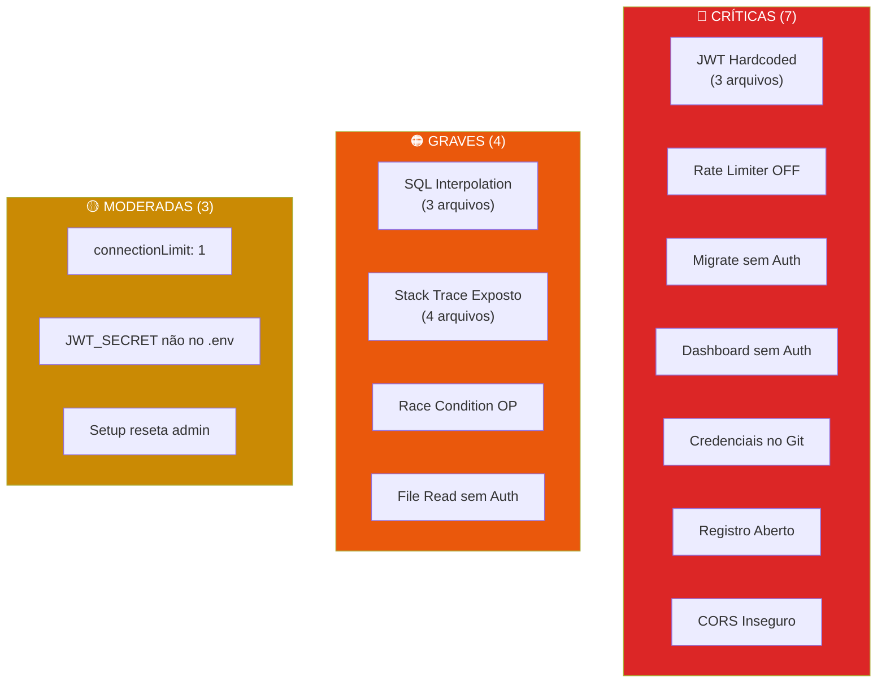
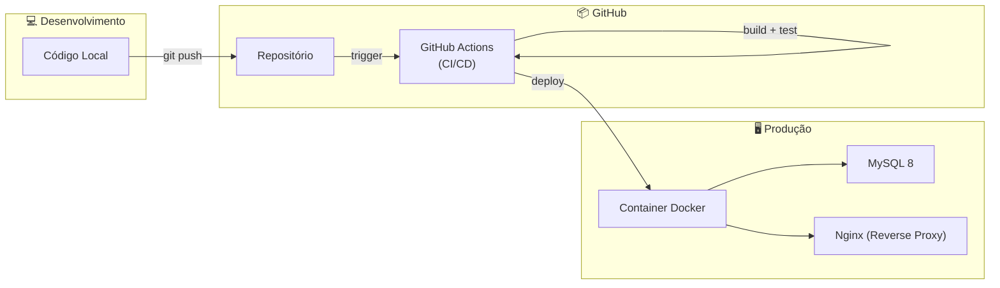

# 🔬 Tudo Que o Projeto Precisa — Análise Profunda e Detalhista

> Este documento é uma radiografia completa do projeto **Sistema de Empenho Financeiro**.
> Cada problema encontrado no código-fonte real é explicado com contexto, impacto e solução.

---

## 📚 Parte 1: O Que é CI/CD (Explicação do Zero)

### O Problema Sem CI/CD

Imagine o seguinte cenário no seu projeto hoje:

1. Você faz uma alteração no código da rota de Ordens de Pagamento
2. Sem querer, quebra o cálculo de retenção de IRRF
3. Faz `git push` para o repositório
4. Copia manualmente os arquivos para o servidor
5. Um operador da SEFAZ emite uma OP com IRRF calculado errado
6. **Ninguém percebe até a auditoria**

**CI/CD existe para impedir que isso aconteça.**

### CI — Integração Contínua (Continuous Integration)

**CI** é um processo automático que roda **toda vez que alguém faz `git push`**. Ele:

```
Desenvolvedor faz git push
        ↓
   GitHub detecta o push
        ↓
   Servidor automático (GitHub Actions) acorda
        ↓
   1. Instala as dependências (npm install)
   2. Verifica tipos TypeScript (tsc --noEmit)
   3. Roda o ESLint (eslint .)
   4. Roda TODOS os testes automatizados
   5. Tenta compilar o projeto (next build)
        ↓
   Se QUALQUER etapa falhar:
   ❌ O push é marcado como "falho"
   ❌ O desenvolvedor recebe um email/notificação
   ❌ O código NÃO vai para produção
        ↓
   Se TUDO passar:
   ✅ O código é marcado como "seguro"
```

**Traduzindo**: CI é um "guarda" que verifica se o código está correto **antes** de chegar ao servidor de produção.

### CD — Entrega Contínua (Continuous Delivery/Deployment)

**CD** é o que acontece **depois** que o CI aprova o código:

```
CI aprovou o código ✅
        ↓
   CD automaticamente:
   1. Compila o projeto para produção (next build)
   2. Cria uma imagem Docker com o projeto
   3. Envia a imagem para o servidor
   4. Reinicia o servidor com a nova versão
   5. Verifica se o servidor está respondendo (health check)
        ↓
   O usuário final já vê a versão nova
   Sem ninguém precisar fazer nada manualmente
```

### Por Que Isso Importa Para o Seu Projeto?

| Sem CI/CD (hoje) | Com CI/CD |
|---|---|
| Deploy manual (copiar arquivos) | Deploy automático a cada `git push` |
| Erros descobertos por usuários | Erros descobertos por testes automáticos |
| "Na minha máquina funciona" | Roda em ambiente padronizado |
| Sem garantia de que o build funciona | Build verificado a cada commit |
| Medo de alterar código | Confiança para refatorar |

---

## 🔴 Parte 2: Auditoria Completa de Segurança

Auditei **linha por linha** cada arquivo do projeto. Encontrei **18 problemas de segurança**, classificados por gravidade.

---

### 🚨 CRÍTICO #1 — JWT_SECRET com Fallback Hardcoded

> [!CAUTION]
> Se alguém esquecer de definir `JWT_SECRET` em produção, **qualquer pessoa que conheça a chave pública pode forjar tokens de autenticação** e acessar o sistema como qualquer usuário, incluindo ADMIN.

**Onde está no código:**

Arquivo [middleware.ts](file:///C:/Users/BOLSONARO2022/.gemini/antigravity/scratch/sistema-empenho-financeiro/middleware.ts#L5-L7):
```typescript
const JWT_SECRET = new TextEncoder().encode(
  process.env.JWT_SECRET || 'chave-local-dev-2026-nao-usar-em-producao'  // ← PERIGO
);
```

Arquivo [lib/auth.ts](file:///C:/Users/BOLSONARO2022/.gemini/antigravity/scratch/sistema-empenho-financeiro/lib/auth.ts#L4-L6):
```typescript
const JWT_SECRET = new TextEncoder().encode(
  process.env.JWT_SECRET || 'chave-local-dev-2026-nao-usar-em-producao'  // ← MESMO PROBLEMA
);
```

Arquivo [app/api/auth/login/route.ts](file:///C:/Users/BOLSONARO2022/.gemini/antigravity/scratch/sistema-empenho-financeiro/app/api/auth/login/route.ts#L8-L10):
```typescript
const JWT_SECRET = new TextEncoder().encode(
  process.env.JWT_SECRET || 'chave-local-dev-2026-nao-usar-em-producao'  // ← 3ª VEZ!
);
```

**Impacto**: A chave `'chave-local-dev-2026-nao-usar-em-producao'` está no código público do GitHub. Qualquer pessoa pode:
1. Ler a chave no repositório
2. Gerar um JWT válido com `perfil: 'ADMIN'`
3. Colocar no cookie `auth_token`
4. Acessar qualquer endpoint do sistema

**Correção**:
```typescript
// lib/jwt-secret.ts — arquivo centralizado
const secret = process.env.JWT_SECRET;
if (!secret) {
  throw new Error(
    '❌ FATAL: JWT_SECRET não está definido nas variáveis de ambiente. ' +
    'O sistema NÃO pode iniciar sem essa configuração.'
  );
}
export const JWT_SECRET = new TextEncoder().encode(secret);
```

---

### 🚨 CRÍTICO #2 — Rate Limiter DESATIVADO no Login

> [!CAUTION]
> O rate limiter está **comentado** no código de produção. Qualquer pessoa pode fazer infinitas tentativas de login por força bruta.

Arquivo [app/api/auth/login/route.ts](file:///C:/Users/BOLSONARO2022/.gemini/antigravity/scratch/sistema-empenho-financeiro/app/api/auth/login/route.ts#L16-L23):
```typescript
// Rate Limiting: max 10 tentativas em 15 minutos (Desativado para testes em LAN)
// Como várias pessoas estão acessando na LAN, todas caem no mesmo IP local.
// const rateCheck = checkRateLimit(ip);
// if (!rateCheck.allowed) {
//   const retryAfterSec = Math.ceil((rateCheck.retryAfterMs || 0) / 1000);
//   return NextResponse.json(
//     { error: `Muitas tentativas de login. Tente novamente em ${retryAfterSec} segundos.` },
//     { status: 429, headers: { 'Retry-After': String(retryAfterSec) } }
//   );
// }
```

**Impacto**: Um atacante pode testar milhares de senhas por minuto sem ser bloqueado. Com a senha padrão `admin123`, um dicionário de senhas comuns descobriria a conta admin em segundos.

**Correção**: Reativar o rate limiter, mas usando o **email/matrícula** como chave em vez do IP:
```typescript
const rateKey = `${ip}:${email}`; // Limita por combinação IP + usuário
const rateCheck = checkRateLimit(rateKey);
```

---

### 🚨 CRÍTICO #3 — Rotas de Migração SEM Autenticação

> [!CAUTION]
> Qualquer pessoa na internet pode executar comandos DDL (ALTER TABLE, DROP COLUMN) no seu banco de dados.

Arquivo [app/api/migrate/route.ts](file:///C:/Users/BOLSONARO2022/.gemini/antigravity/scratch/sistema-empenho-financeiro/app/api/migrate/route.ts):
```typescript
export async function GET() {
  // NENHUMA verificação de autenticação!
  // Qualquer pessoa pode acessar GET /api/migrate
  try {
    await query("ALTER TABLE notas_empenho ADD COLUMN elemento VARCHAR(50);");
    await query("ALTER TABLE notas_empenho DROP COLUMN elemento_subelemento;");
    // ...
  }
}
```

Arquivo [app/api/setup/migrate/route.ts](file:///C:/Users/BOLSONARO2022/.gemini/antigravity/scratch/sistema-empenho-financeiro/app/api/setup/migrate/route.ts):
```typescript
// MESMO PROBLEMA — rota pública no middleware (startsWith('/api/setup'))
```

**Impacto**: Alguém acessa `https://seusite.com/api/migrate` no navegador e **altera a estrutura do seu banco de dados**. Pode dropar colunas, corrompendo dados.

**Correção**: Estas rotas devem ser scripts CLI executados manualmente, **nunca endpoints HTTP**. Se precisar manter como API:
```typescript
export async function GET(request: NextRequest) {
  const user = await getAuthUser(request);
  if (!user || user.perfil !== 'ADMIN') return forbiddenResponse();
  // ... resto da lógica
}
```

---

### 🚨 CRÍTICO #4 — Dashboard SEM Autenticação

Arquivo [app/api/dashboard/stats/route.ts](file:///C:/Users/BOLSONARO2022/.gemini/antigravity/scratch/sistema-empenho-financeiro/app/api/dashboard/stats/route.ts):
```typescript
export async function GET(request: NextRequest) {
  // NENHUMA verificação de autenticação!
  // Qualquer pessoa pode ver valores financeiros, nomes de credores, etc.
  try {
    const [credoresCount] = await query<any[]>('SELECT COUNT(*) as total FROM credores...');
    // ... expõe dados financeiros sensíveis
  }
}
```

**Impacto**: Dados financeiros públicos acessíveis via `GET /api/dashboard/stats`.

**Correção**: Adicionar `getAuthUser` no início da função.

---

### 🚨 CRÍTICO #5 — Credenciais Hardcoded no Repositório Público

Arquivo [setup_db.js](file:///C:/Users/BOLSONARO2022/.gemini/antigravity/scratch/sistema-empenho-financeiro/setup_db.js#L5-L11):
```javascript
const connection = await mysql.createConnection({
  host: 'DAGMCGPA100',           // ← Nome do servidor interno da SEFAZ
  port: 3306,
  user: 'admin',                  // ← Usuário do banco
  password: 'qwe124578',          // ← SENHA DO BANCO EXPOSTA PUBLICAMENTE
  database: 'empenho'
});
```

**Impacto**: Qualquer pessoa que visite o GitHub pode ver:
- O nome do servidor de banco de dados interno (`DAGMCGPA100`)
- Credenciais de acesso ao MySQL (`admin` / `qwe124578`)
- A topologia interna da rede (IPs em `next.config.ts`: `10.82.28.48`, `nagmcggr019`)

> [!WARNING]
> **Mesmo que você delete este arquivo agora, ele continuará acessível no histórico do Git.** Será necessário alterar a senha do banco de dados e rotacionar credenciais.

---

### 🚨 CRÍTICO #6 — Registro Aberto Sem Aprovação

Arquivo [app/api/auth/register/route.ts](file:///C:/Users/BOLSONARO2022/.gemini/antigravity/scratch/sistema-empenho-financeiro/app/api/auth/register/route.ts):
```typescript
export async function POST(request: NextRequest) {
  // QUALQUER pessoa pode criar uma conta com perfil 'GESTOR'
  // Sem necessidade de convite, aprovação ou token de registro
  const { nome, senha } = body;
  await query(
    `INSERT INTO usuarios ... VALUES (?, ?, ?, ?, 'GESTOR', 1)`,
    [id, nome.trim(), fakeEmail, hash]
  );
}
```

**Impacto**: Qualquer pessoa pode criar uma conta no sistema e acessar dados financeiros da SEFAZ.

**Correção**: O registro deve ser feito apenas por um ADMIN:
```typescript
export async function POST(request: NextRequest) {
  const admin = await getAuthUser(request);
  if (!admin || admin.perfil !== 'ADMIN') return forbiddenResponse();
  // ... agora sim, cria o usuário
}
```

---

### 🚨 CRÍTICO #7 — CORS Configurado de Forma Insegura

Arquivo [next.config.ts](file:///C:/Users/BOLSONARO2022/.gemini/antigravity/scratch/sistema-empenho-financeiro/next.config.ts#L30-L32):
```typescript
{ key: "Access-Control-Allow-Credentials", value: "true" },
{ key: "Access-Control-Allow-Origin", value: "*" },  // ← CONFLITO PERIGOSO
```

**Impacto**: `Allow-Credentials: true` + `Allow-Origin: *` é uma **violação da especificação CORS**. Navegadores modernos ignoram essa combinação, mas versões antigas ou ferramentas podem explorar isso para fazer requisições autenticadas de qualquer domínio.

**Correção**: Substituir `*` pelo domínio específico:
```typescript
{ key: "Access-Control-Allow-Origin", value: process.env.APP_URL || "http://localhost:3000" },
```

---

### 🟠 GRAVE #8 — Interpolação SQL (Risco de SQL Injection)

Arquivo [app/api/credores/route.ts](file:///C:/Users/BOLSONARO2022/.gemini/antigravity/scratch/sistema-empenho-financeiro/app/api/credores/route.ts):
```typescript
sql += ` ORDER BY nome ASC LIMIT ${limit} OFFSET ${offset}`;
//                               ^^^^^^^^^^^^^^^^^^^^^^^^^^^^^^
// Interpolação direta de variáveis na query SQL
```

O mesmo padrão se repete em:
- [app/api/notas-empenho/route.ts](file:///C:/Users/BOLSONARO2022/.gemini/antigravity/scratch/sistema-empenho-financeiro/app/api/notas-empenho/route.ts)
- [app/api/ordens-pagamento/route.ts](file:///C:/Users/BOLSONARO2022/.gemini/antigravity/scratch/sistema-empenho-financeiro/app/api/ordens-pagamento/route.ts)

**Por que é perigoso**: Embora `parseInt` seja usado antes, é uma **má prática** que pode causar regressões. Se alguém remover o `parseInt` sem perceber, abre-se SQL injection.

**Correção**: Usar placeholders sempre:
```typescript
sql += ' ORDER BY nome ASC LIMIT ? OFFSET ?';
params.push(limit, offset);
```

---

### 🟠 GRAVE #9 — Stack Trace Exposto na Resposta de Erro

Arquivo [app/api/auth/login/route.ts](file:///C:/Users/BOLSONARO2022/.gemini/antigravity/scratch/sistema-empenho-financeiro/app/api/auth/login/route.ts):
```typescript
return NextResponse.json(
  { error: 'Erro interno no servidor: ' + ((error as any).stack || String(error)) },
  //                                       ^^^^^^^^^^^^^^^^^^^^^^^^^^^^^^^^^^^^^^^
  // EXPÕE STACK TRACE COMPLETO PARA O CLIENTE
  { status: 500 }
);
```

O mesmo acontece em:
- [app/api/analise-planilha/route.ts](file:///C:/Users/BOLSONARO2022/.gemini/antigravity/scratch/sistema-empenho-financeiro/app/api/analise-planilha/route.ts): `{ error: error.message, stack: error.stack }`
- [app/api/analyze-excel/route.ts](file:///C:/Users/BOLSONARO2022/.gemini/antigravity/scratch/sistema-empenho-financeiro/app/api/analyze-excel/route.ts): `{ error: error.message, stack: error.stack }`
- [app/api/credores/[id]/route.ts](file:///C:/Users/BOLSONARO2022/.gemini/antigravity/scratch/sistema-empenho-financeiro/app/api/credores/%5Bid%5D/route.ts): `error: error.sqlMessage || error.message`

**Impacto**: Atacantes podem ver caminhos internos do servidor, queries SQL, nomes de tabelas e colunas.

**Correção**: Em produção, nunca retornar detalhes do erro:
```typescript
return NextResponse.json(
  { error: 'Erro interno no servidor.' },
  { status: 500 }
);
// Log apenas no servidor:
console.error('[API Auth] Erro interno:', error);
```

---

### 🟠 GRAVE #10 — Race Condition na Geração de Número de OP

Arquivo [app/api/ordens-pagamento/route.ts](file:///C:/Users/BOLSONARO2022/.gemini/antigravity/scratch/sistema-empenho-financeiro/app/api/ordens-pagamento/route.ts):
```typescript
// Gera sequencial baseado em COUNT(*) — NÃO é atômico!
const [seqResult]: any = await conn.execute(
  'SELECT COUNT(*) as total FROM ordens_pagamento'
);
const seq = (seqResult[0]?.total || 0) + 1;
const numeroCheque = `OP-${ano}-${String(seq).padStart(6, '0')}`;
```

**Impacto**: Se dois operadores criarem OPs simultaneamente, ambos recebem o **mesmo COUNT** e geram o **mesmo número de cheque**, causando violação de UNIQUE constraint ou, pior, dados duplicados.

**Correção**: Usar `AUTO_INCREMENT` ou `SELECT ... FOR UPDATE` com tabela sequencial:
```sql
-- Tabela auxiliar
CREATE TABLE sequenciais (
  tipo VARCHAR(20) PRIMARY KEY,
  ultimo_numero INT NOT NULL DEFAULT 0
);

-- Na transação:
SELECT ultimo_numero FROM sequenciais WHERE tipo = 'OP' FOR UPDATE;
UPDATE sequenciais SET ultimo_numero = ultimo_numero + 1 WHERE tipo = 'OP';
```

---

### 🟠 GRAVE #11 — Rotas de Leitura de Arquivos Sem Autenticação

Arquivos [app/api/analise-planilha/route.ts](file:///C:/Users/BOLSONARO2022/.gemini/antigravity/scratch/sistema-empenho-financeiro/app/api/analise-planilha/route.ts) e [app/api/analyze-excel/route.ts](file:///C:/Users/BOLSONARO2022/.gemini/antigravity/scratch/sistema-empenho-financeiro/app/api/analyze-excel/route.ts):

```typescript
export async function GET() {
  // SEM AUTENTICAÇÃO!
  const cwd = process.cwd();
  const filesInDir = fs.readdirSync(cwd);  // ← Lista arquivos do servidor
  const buf = fs.readFileSync(targetPath);  // ← Lê arquivos do disco
}
```

**Impacto**: Qualquer pessoa pode ler o conteúdo de arquivos `.xlsx` presentes no diretório raiz do servidor.

> [!NOTE]
> Estas duas rotas são praticamente **idênticas** (código duplicado com variação mínima). Uma delas deve ser removida.

---

### 🟡 MODERADO #12 — `connectionLimit: 1` no Config do DB

Arquivo [lib/db.ts](file:///C:/Users/BOLSONARO2022/.gemini/antigravity/scratch/sistema-empenho-financeiro/lib/db.ts#L10):
```typescript
const dbConfig = {
  connectionLimit: 1, // coloquei 1 pra nao explodir conexoes no XAMPP
};
```

**Impacto**: Embora seja sobrescrito depois (5 em dev, 50 em prod), o comentário indica que o XAMPP local não suportava múltiplas conexões. O `dbConfig` com `connectionLimit: 1` é confuso e pode causar problemas se alguém usar diretamente.

---

### 🟡 MODERADO #13 — `JWT_SECRET` Ausente no `.env.example`

Arquivo [.env.example](file:///C:/Users/BOLSONARO2022/.gemini/antigravity/scratch/sistema-empenho-financeiro/.env.example):
```env
GEMINI_API_KEY="MY_GEMINI_API_KEY"
APP_URL="MY_APP_URL"
MYSQL_HOST="localhost"
MYSQL_PORT="3306"
MYSQL_USER="root"
MYSQL_PASSWORD=""
MYSQL_DATABASE="empenho"
# ← CADÊ O JWT_SECRET???
```

**Impacto**: Desenvolvedores novos não saberão que precisam configurar `JWT_SECRET`, e o sistema usará o fallback hardcoded silenciosamente.

---

### 🟡 MODERADO #14 — Setup Recria Senha Admin em Desenvolvimento

Arquivo [app/api/setup/route.ts](file:///C:/Users/BOLSONARO2022/.gemini/antigravity/scratch/sistema-empenho-financeiro/app/api/setup/route.ts):
```typescript
// Se NODE_ENV !== 'production', qualquer pessoa pode:
// 1. Acessar GET /api/setup
// 2. Resetar a senha do admin para 'admin123'
// 3. Fazer login como ADMIN
```

---

### Resumo Visual — Mapa de Vulnerabilidades



---

## 🧪 Parte 3: Testes Automatizados — O Que, Por Quê e Como

### O Que São Testes Automatizados?

Testes automatizados são **programas que verificam se o seu código funciona corretamente**. Em vez de um ser humano abrir o navegador e testar cada funcionalidade manualmente, o computador faz isso em segundos.

### Os 3 Tipos Que o Projeto Precisa

#### 1. Testes Unitários — "Cada peça funciona sozinha?"

Testam **funções isoladas**, sem banco de dados, sem servidor.

```typescript
// Exemplo: testar a função maskCurrency de lib/utils.ts
import { maskCurrency, parseFormNumber, numeroPorExtenso } from '@/lib/utils';

describe('maskCurrency', () => {
  test('formata 1500 como "1.500,00"', () => {
    expect(maskCurrency(1500)).toBe('1.500,00');
  });

  test('formata 0 como "0,00"', () => {
    expect(maskCurrency(0)).toBe('0,00');
  });

  test('formata 1234567.89 como "1.234.567,89"', () => {
    expect(maskCurrency(1234567.89)).toBe('1.234.567,89');
  });
});

describe('parseFormNumber', () => {
  test('converte "1.500,00" para 1500', () => {
    expect(parseFormNumber('1.500,00')).toBe(1500);
  });

  test('converte string vazia para 0', () => {
    expect(parseFormNumber('')).toBe(0);
  });
});

describe('numeroPorExtenso', () => {
  test('converte 1500 para "um mil e quinhentos reais"', () => {
    expect(numeroPorExtenso(1500)).toContain('mil');
    expect(numeroPorExtenso(1500)).toContain('quinhentos');
  });
});
```

#### 2. Testes de Integração — "As peças funcionam juntas?"

Testam **APIs completas** com banco de dados real (em memória ou test container).

```typescript
// Exemplo: testar a API de credores
describe('POST /api/credores', () => {
  test('cria credor com dados válidos', async () => {
    const res = await fetch('/api/credores', {
      method: 'POST',
      headers: { 'Content-Type': 'application/json', Cookie: authCookie },
      body: JSON.stringify({
        nome: 'Empresa Teste LTDA',
        cpfCnpj: '11.222.333/0001-44',
      }),
    });

    expect(res.status).toBe(201);
    const data = await res.json();
    expect(data.success).toBe(true);
    expect(data.id).toBeDefined();
  });

  test('rejeita CPF/CNPJ duplicado', async () => {
    // Cria o primeiro
    await criarCredor({ cpfCnpj: '11.222.333/0001-44' });
    
    // Tenta criar duplicado
    const res = await criarCredor({ cpfCnpj: '11.222.333/0001-44' });
    expect(res.status).toBe(409);
  });

  test('rejeita sem autenticação', async () => {
    const res = await fetch('/api/credores', {
      method: 'POST',
      body: JSON.stringify({ nome: 'Teste' }),
    });
    expect(res.status).toBe(401);
  });
});
```

#### 3. Testes de Regras de Negócio — "A contabilidade está certa?"

**Estes são os mais importantes para o seu sistema.** Verificam que as regras da Lei 4.320/64 estão sendo cumpridas.

```typescript
describe('Regras de Negócio - Ordens de Pagamento', () => {
  test('não permite OP com valor maior que saldo da NE', async () => {
    // NE de R$ 10.000,00
    const ne = await criarNE({ valor: 10000 });
    
    // OP de R$ 15.000,00 — deve falhar
    const res = await criarOP({ numeroNe: ne.numero, valorPagamento: 15000 });
    expect(res.status).toBe(422);
  });

  test('calcula retenções tributárias corretamente', () => {
    const valor = 10000;
    const irrf = valor * 0.015;    // 1,5%
    const inss = valor * 0.11;     // 11%
    const iss = valor * 0.05;      // 5%
    const totalDescontos = irrf + inss + iss;
    const valorLiquido = valor - totalDescontos;

    expect(irrf).toBe(150);
    expect(inss).toBe(1100);
    expect(iss).toBe(500);
    expect(valorLiquido).toBe(8250);
  });

  test('atualiza status da NE após pagamento total', async () => {
    const ne = await criarNE({ valor: 5000 });
    await criarOP({ numeroNe: ne.numero, valorPagamento: 5000 });
    
    const neAtualizada = await buscarNE(ne.id);
    expect(neAtualizada.status).toBe('LIQUIDADO');
  });

  test('impede exclusão de credor com OPs vinculadas', async () => {
    const credor = await criarCredor();
    const ne = await criarNE();
    await criarOP({ numeroNe: ne.numero, credorCpfCnpj: credor.cpfCnpj });

    const res = await deletarCredor(credor.id);
    expect(res.status).toBe(409); // Conflito
  });
});
```

### O Que Instalar Para Testes

```bash
npm install --save-dev vitest @testing-library/react @testing-library/jest-dom jsdom
```

Arquivo `vitest.config.ts`:
```typescript
import { defineConfig } from 'vitest/config';
import path from 'path';

export default defineConfig({
  test: {
    environment: 'jsdom',
    globals: true,
    setupFiles: ['./tests/setup.ts'],
  },
  resolve: {
    alias: {
      '@': path.resolve(__dirname, '.'),
    },
  },
});
```

### Quais Testes Escrever Primeiro (Prioridade)

| Prioridade | O Que Testar | Por Quê |
|---|---|---|
| 🔴 1ª | Cálculos financeiros (retenções, saldos) | Erro aqui = dinheiro público calculado errado |
| 🔴 2ª | Regras de negócio (limites de empenho, status) | Erro aqui = violação da Lei 4.320/64 |
| 🟠 3ª | APIs de CRUD (criar, editar, excluir) | Erro aqui = dados corrompidos |
| 🟠 4ª | Autenticação e autorização | Erro aqui = acesso indevido |
| 🟡 5ª | Funções utilitárias (maskCurrency, etc.) | Menor risco, mas fácil de testar |

---

## 🧹 Parte 4: Limpeza de Scripts Residuais

### O Que São Esses Scripts?

São **scripts one-shot** — ferramentas usadas uma vez durante o desenvolvimento para fazer migrações em massa e que **não deveriam ter sido commitados no repositório**:

| Arquivo | O Que Faz | Deve Ficar? |
|---|---|---|
| [fix_remaining.js](file:///C:/Users/BOLSONARO2022/.gemini/antigravity/scratch/sistema-empenho-financeiro/fix_remaining.js) | Substituiu cores hex no CSS | ❌ Remover |
| [update_colors.js](file:///C:/Users/BOLSONARO2022/.gemini/antigravity/scratch/sistema-empenho-financeiro/update_colors.js) | Migrou paleta teal → emerald | ❌ Remover |
| [update_colors2.js](file:///C:/Users/BOLSONARO2022/.gemini/antigravity/scratch/sistema-empenho-financeiro/update_colors2.js) | Migrou slate → zinc | ❌ Remover |
| [update_colors3.js](file:///C:/Users/BOLSONARO2022/.gemini/antigravity/scratch/sistema-empenho-financeiro/update_colors3.js) | Suavizou contrastes | ❌ Remover |
| [remove-mocks.js](file:///C:/Users/BOLSONARO2022/.gemini/antigravity/scratch/sistema-empenho-financeiro/remove-mocks.js) | Removeu dados mock das páginas | ❌ Remover |
| [setup_db.js](file:///C:/Users/BOLSONARO2022/.gemini/antigravity/scratch/sistema-empenho-financeiro/setup_db.js) | Setup inicial do banco (COM SENHA HARDCODED!) | ❌ Remover URGENTE |
| [tsconfig.tsbuildinfo](file:///C:/Users/BOLSONARO2022/.gemini/antigravity/scratch/sistema-empenho-financeiro/tsconfig.tsbuildinfo) | Cache do TypeScript (gerado automaticamente) | ❌ Remover + gitignore |

### Como Limpar

```bash
# Remover os arquivos
git rm fix_remaining.js update_colors.js update_colors2.js update_colors3.js
git rm remove-mocks.js setup_db.js tsconfig.tsbuildinfo

# Garantir que não voltem
# (Já estão no .gitignore, mas verificar)
git commit -m "chore: remove scripts residuais e arquivos gerados"
```

### Outros Arquivos a Limpar

- [app/api/analise-planilha/route.ts](file:///C:/Users/BOLSONARO2022/.gemini/antigravity/scratch/sistema-empenho-financeiro/app/api/analise-planilha/route.ts) — **Duplicata** de `analyze-excel`. Remover uma delas.
- [app/api/migrate/route.ts](file:///C:/Users/BOLSONARO2022/.gemini/antigravity/scratch/sistema-empenho-financeiro/app/api/migrate/route.ts) — **Migração não deveria ser endpoint HTTP**. Mover para `scripts/`.
- [lib/store.ts](file:///C:/Users/BOLSONARO2022/.gemini/antigravity/scratch/sistema-empenho-financeiro/lib/store.ts) — Dados mock de credores ainda presentes. Limpar o array inicial:

```diff
  credores: [
-   { id: '1', nome: 'Jose Silva Oliveira', ... },
-   { id: '2', nome: 'Maria Cavalcanti S/A', ... },
-   { id: '3', nome: 'Tech Solution LTDA', ... },
+   // Credores são carregados do banco de dados via API
  ],
```

---

## 🚀 Parte 5: Infraestrutura de Deploy Automatizado

### O Que o Projeto Precisa Para Deploy Profissional



### 1. Dockerfile

```dockerfile
# ---- Etapa 1: Instalar dependências ----
FROM node:20-alpine AS deps
WORKDIR /app
COPY package.json package-lock.json ./
RUN npm ci --omit=dev

# ---- Etapa 2: Compilar ----
FROM node:20-alpine AS builder
WORKDIR /app
COPY --from=deps /app/node_modules ./node_modules
COPY . .

# Variáveis de build (NÃO colocar segredos aqui)
ENV NEXT_TELEMETRY_DISABLED=1
ENV NODE_ENV=production

RUN npm run build

# ---- Etapa 3: Executar ----
FROM node:20-alpine AS runner
WORKDIR /app

ENV NODE_ENV=production
ENV NEXT_TELEMETRY_DISABLED=1

# Criar usuário não-root (segurança)
RUN addgroup --system --gid 1001 nodejs
RUN adduser --system --uid 1001 nextjs

# Copiar apenas o necessário (standalone output)
COPY --from=builder /app/.next/standalone ./
COPY --from=builder /app/.next/static ./.next/static
COPY --from=builder /app/public ./public

USER nextjs

EXPOSE 3000
ENV PORT=3000
ENV HOSTNAME="0.0.0.0"

CMD ["node", "server.js"]
```

### 2. docker-compose.yml

```yaml
version: '3.8'

services:
  app:
    build: .
    ports:
      - "3000:3000"
    environment:
      - NODE_ENV=production
      - JWT_SECRET=${JWT_SECRET}
      - MYSQL_HOST=db
      - MYSQL_PORT=3306
      - MYSQL_USER=${MYSQL_USER}
      - MYSQL_PASSWORD=${MYSQL_PASSWORD}
      - MYSQL_DATABASE=empenho
      - GEMINI_API_KEY=${GEMINI_API_KEY}
    depends_on:
      db:
        condition: service_healthy
    restart: unless-stopped

  db:
    image: mysql:8.0
    environment:
      MYSQL_ROOT_PASSWORD: ${MYSQL_ROOT_PASSWORD}
      MYSQL_DATABASE: empenho
      MYSQL_USER: ${MYSQL_USER}
      MYSQL_PASSWORD: ${MYSQL_PASSWORD}
    volumes:
      - mysql_data:/var/lib/mysql
      - ./database/database.sql:/docker-entrypoint-initdb.d/01-schema.sql
      - ./database/migration_01.sql:/docker-entrypoint-initdb.d/02-migration.sql
    ports:
      - "3306:3306"
    healthcheck:
      test: ["CMD", "mysqladmin", "ping", "-h", "localhost"]
      interval: 10s
      timeout: 5s
      retries: 5
    restart: unless-stopped

volumes:
  mysql_data:
```

### 3. GitHub Actions — CI/CD Pipeline

Arquivo `.github/workflows/ci.yml`:

```yaml
name: CI/CD Pipeline

# Quando executar:
on:
  push:
    branches: [main, develop]    # A cada push nessas branches
  pull_request:
    branches: [main]             # A cada PR para main

jobs:
  # ============================================
  # JOB 1: Verificar qualidade do código
  # ============================================
  quality:
    name: '🔍 Qualidade do Código'
    runs-on: ubuntu-latest
    
    steps:
      - name: Checkout do código
        uses: actions/checkout@v4

      - name: Setup Node.js 20
        uses: actions/setup-node@v4
        with:
          node-version: '20'
          cache: 'npm'

      - name: Instalar dependências
        run: npm ci

      - name: Verificar tipos TypeScript
        run: npx tsc --noEmit

      - name: Rodar ESLint
        run: npm run lint

  # ============================================
  # JOB 2: Rodar testes automatizados
  # ============================================
  test:
    name: '🧪 Testes'
    runs-on: ubuntu-latest
    needs: quality  # Só roda se a qualidade passou

    services:
      # Sobe um MySQL temporário para os testes
      mysql:
        image: mysql:8.0
        env:
          MYSQL_ROOT_PASSWORD: test_root_pass
          MYSQL_DATABASE: empenho_test
        ports:
          - 3306:3306
        options: >-
          --health-cmd "mysqladmin ping -h localhost"
          --health-interval 10s
          --health-timeout 5s
          --health-retries 5

    steps:
      - uses: actions/checkout@v4
      - uses: actions/setup-node@v4
        with:
          node-version: '20'
          cache: 'npm'

      - run: npm ci

      - name: Rodar testes
        run: npx vitest run --reporter=verbose
        env:
          MYSQL_HOST: localhost
          MYSQL_PORT: 3306
          MYSQL_USER: root
          MYSQL_PASSWORD: test_root_pass
          MYSQL_DATABASE: empenho_test
          JWT_SECRET: chave-de-teste-apenas-ci

  # ============================================
  # JOB 3: Build de produção
  # ============================================
  build:
    name: '🏗️ Build'
    runs-on: ubuntu-latest
    needs: test  # Só roda se os testes passaram

    steps:
      - uses: actions/checkout@v4
      - uses: actions/setup-node@v4
        with:
          node-version: '20'
          cache: 'npm'

      - run: npm ci
      - run: npm run build
        env:
          JWT_SECRET: build-placeholder  # Necessário para build

      - name: Upload do artefato de build
        uses: actions/upload-artifact@v4
        with:
          name: build-output
          path: .next/
          retention-days: 7
```

### O Que Esse Pipeline Faz (Passo a Passo)

```
Você faz: git push origin main
                ↓
GitHub Actions acorda automaticamente
                ↓
┌─────────────────────────────────┐
│ JOB 1: Qualidade do Código     │
│  ✓ Instala dependências        │
│  ✓ Verifica tipos TypeScript   │
│  ✓ Roda ESLint                 │
│  Se falhar → ❌ Para tudo       │
└────────────────┬────────────────┘
                 ↓ (passou)
┌─────────────────────────────────┐
│ JOB 2: Testes Automatizados    │
│  ✓ Sobe MySQL temporário       │
│  ✓ Roda todos os testes        │
│  ✓ Verifica cálculos, APIs     │
│  Se falhar → ❌ Para tudo       │
└────────────────┬────────────────┘
                 ↓ (passou)
┌─────────────────────────────────┐
│ JOB 3: Build de Produção       │
│  ✓ Compila o Next.js           │
│  ✓ Gera o pacote standalone    │
│  ✓ Salva como artefato         │
│  Se falhar → ❌ Para tudo       │
└────────────────┬────────────────┘
                 ↓ (passou)
          ✅ Código aprovado!
     Pronto para deploy manual ou
     automático via CD
```

---

## 📋 Parte 6: Lista Completa de Melhorias Adicionais

### Arquitetura e Código

| # | Melhoria | Dificuldade | Impacto |
|---|---|:---:|:---:|
| 1 | **Centralizar JWT_SECRET** em um único arquivo | Fácil | Alto |
| 2 | **Criar camada de repositório** (separar SQL das routes) | Médio | Alto |
| 3 | **Adicionar ORM** (Prisma ou Drizzle) para type-safety | Médio | Alto |
| 4 | **Implementar refresh token** (renovação automática do JWT) | Médio | Médio |
| 5 | **Criar middleware de logging** estruturado (Winston/Pino) | Fácil | Médio |
| 6 | **Adicionar validação Zod em TODAS as routes** (algumas não têm) | Fácil | Alto |
| 7 | **Migrar rate limiter para Redis** (para múltiplas instâncias) | Médio | Médio |
| 8 | **Implementar audit log** (quem alterou o quê e quando) | Médio | Alto |
| 9 | **Criar roles/permissions granulares** (por módulo, não só admin/gestor) | Difícil | Alto |
| 10 | **Adicionar paginação cursor-based** (em vez de offset, que é lento com volume) | Médio | Médio |

### Infraestrutura e DevOps

| # | Melhoria | Dificuldade | Impacto |
|---|---|:---:|:---:|
| 11 | **Criar Dockerfile** (containerização) | Fácil | Alto |
| 12 | **Criar docker-compose.yml** (app + MySQL) | Fácil | Alto |
| 13 | **Configurar CI/CD** (GitHub Actions) | Médio | Alto |
| 14 | **Adicionar health check** (`/api/health`) | Fácil | Médio |
| 15 | **Configurar backup automático do MySQL** | Médio | Crítico |
| 16 | **Adicionar monitoramento** (uptime, erros, performance) | Médio | Alto |
| 17 | **Configurar HTTPS** com certificado SSL | Fácil | Crítico |

### Documentação

| # | Melhoria | Dificuldade | Impacto |
|---|---|:---:|:---:|
| 18 | **Documentar API com Swagger/OpenAPI** | Médio | Médio |
| 19 | **Criar guia de contribuição** (CONTRIBUTING.md) | Fácil | Baixo |
| 20 | **Documentar variáveis de ambiente** (completar .env.example) | Fácil | Alto |
| 21 | **Adicionar changelog** (CHANGELOG.md) | Fácil | Baixo |

---

## 🎯 Ordem Recomendada de Execução

> [!IMPORTANT]
> **Fase 1 (URGENTE — Segurança):** Faça ANTES de qualquer outra coisa. São correções que protegem o sistema contra ataques.

```
FASE 1 — Segurança (1-2 dias)
├── Remover fallback do JWT_SECRET (3 arquivos)
├── Adicionar JWT_SECRET no .env.example
├── Reativar rate limiter no login
├── Adicionar autenticação no dashboard/stats
├── Remover/proteger rotas de migração
├── Proteger rota de registro (só admin cria contas)
├── Corrigir CORS (substituir * pelo domínio)
├── Remover stack traces das respostas de erro
├── Alterar senha do banco (está pública no GitHub)
└── Remover setup_db.js (contém credenciais)

FASE 2 — Limpeza (1 dia)
├── Remover scripts residuais (fix_remaining, update_colors, etc.)
├── Remover rota duplicada (analise-planilha ou analyze-excel)
├── Limpar dados mock do Zustand store
├── Remover tsconfig.tsbuildinfo do repositório
└── Usar placeholders SQL para LIMIT/OFFSET

FASE 3 — Testes (3-5 dias)
├── Instalar Vitest
├── Testes unitários (utils, cálculos)
├── Testes de integração (APIs)
├── Testes de regras de negócio (contabilidade)
└── Adicionar script "test" no package.json

FASE 4 — Infraestrutura (2-3 dias)
├── Criar Dockerfile
├── Criar docker-compose.yml
├── Criar GitHub Actions (CI pipeline)
├── Adicionar health check endpoint
└── Configurar backup do MySQL

FASE 5 — Evolução (contínuo)
├── Migrar para ORM (Prisma/Drizzle)
├── Implementar audit log
├── Documentar API (Swagger)
├── Monitoramento e alertas
└── Roles e permissões granulares
```
