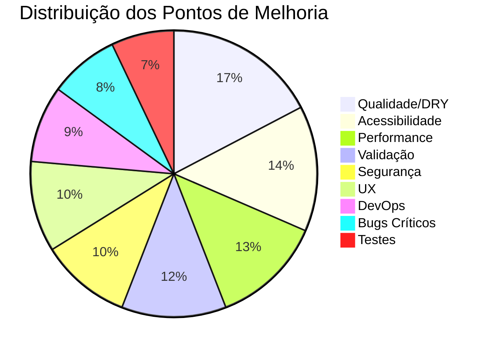

# 📋 Varredura Completa — TODOS os Pontos de Melhoria

> **Escopo:** Cada arquivo do repositório lido linha por linha
> **Arquivos analisados:** 70+ arquivos (25 API routes, 11 páginas, 9 componentes, 10 libs, 6 testes, 10 configs)
> **Total de pontos encontrados:** 127

---

## 🔴 BUGS CRÍTICOS (que quebram funcionalidade)

| # | Arquivo | Bug | Impacto |
|---|---|---|---|
| 1 | [app/api/usuarios/route.ts](file:///C:/Users/BOLSONARO2022/.gemini/antigravity/scratch/sistema-empenho-financeiro/app/api/usuarios/route.ts) | INSERT usa colunas `cpf` e `password_hash`, mas a tabela tem `senha_hash` e não tem `cpf` | **Rota vai crashar 100% — `ER_BAD_FIELD_ERROR`** |
| 2 | [app/api/perfil/senha/route.ts](file:///C:/Users/BOLSONARO2022/.gemini/antigravity/scratch/sistema-empenho-financeiro/app/api/perfil/senha/route.ts) | Usa `senha_hash` mas criação de usuários usa `password_hash` — um dos dois está errado | **Alterar senha não funciona** |
| 3 | [app/api/setup/migrate/route.ts](file:///C:/Users/BOLSONARO2022/.gemini/antigravity/scratch/sistema-empenho-financeiro/app/api/setup/migrate/route.ts) | Rota de migração DDL **sem NENHUMA autenticação** — nem auth, nem environment check | **Qualquer pessoa pode alterar a estrutura do banco** |
| 4 | [database/migration_01.sql](file:///C:/Users/BOLSONARO2022/.gemini/antigravity/scratch/sistema-empenho-financeiro/database/migration_01.sql) | `created_by INT` tenta FK para `usuarios(id)` que é `VARCHAR(36)` | **Migração vai crashar MySQL — type mismatch** |
| 5 | [app/api/notas-empenho/[id]/route.ts](file:///C:/Users/BOLSONARO2022/.gemini/antigravity/scratch/sistema-empenho-financeiro/app/api/notas-empenho/%5Bid%5D/route.ts) | UPDATE de `numero_ne` em ordens_pagamento usa string mutável como FK em vez de UUID | **Pode criar registros órfãos se sync falhar** |
| 6 | [app/configuracoes/page.tsx](file:///C:/Users/BOLSONARO2022/.gemini/antigravity/scratch/sistema-empenho-financeiro/app/configuracoes/page.tsx) | `handlePasswordSubmit` **finge** salvar — mostra toast de sucesso sem chamar nenhuma API | **Usuário acha que mudou a senha, mas não mudou** |
| 7 | [app/suporte/page.tsx](file:///C:/Users/BOLSONARO2022/.gemini/antigravity/scratch/sistema-empenho-financeiro/app/suporte/page.tsx) | Formulário "Abrir Chamado" não submete para nenhuma API | **Chamados são perdidos** |
| 8 | [components/shell.tsx](file:///C:/Users/BOLSONARO2022/.gemini/antigravity/scratch/sistema-empenho-financeiro/components/shell.tsx) | `useEffect` desregistra **todos** os Service Workers no mount | **Quebra permanentemente capacidades PWA/offline** |
| 9 | [app/api/credores/[id]/route.ts](file:///C:/Users/BOLSONARO2022/.gemini/antigravity/scratch/sistema-empenho-financeiro/app/api/credores/%5Bid%5D/route.ts) | DELETE não retorna 404 se credor não existe — faz soft delete de ID inexistente | **Retorna sucesso para exclusão de fantasma** |
| 10 | [app/login/page.tsx](file:///C:/Users/BOLSONARO2022/.gemini/antigravity/scratch/sistema-empenho-financeiro/app/login/page.tsx) | Usa `window.location.href = "/"` em vez de `router.push("/")` | **Recarrega a SPA inteira, perde estado** |

---

## 🔐 SEGURANÇA (13 pontos)

| # | Arquivo | Problema |
|---|---|---|
| 11 | [app/api/auth/login/route.ts](file:///C:/Users/BOLSONARO2022/.gemini/antigravity/scratch/sistema-empenho-financeiro/app/api/auth/login/route.ts) | `X-Forwarded-For` controlável pelo cliente — rate limiter contornável |
| 12 | [lib/rate-limiter.ts](file:///C:/Users/BOLSONARO2022/.gemini/antigravity/scratch/sistema-empenho-financeiro/lib/rate-limiter.ts) | Map in-memory sem limite de tamanho — possível DoS por exaustão de memória |
| 13 | [lib/rate-limiter.ts](file:///C:/Users/BOLSONARO2022/.gemini/antigravity/scratch/sistema-empenho-financeiro/lib/rate-limiter.ts) | Não funciona em ambientes multi-instância (serverless, múltiplos pods) |
| 14 | [app/api/auth/register/route.ts](file:///C:/Users/BOLSONARO2022/.gemini/antigravity/scratch/sistema-empenho-financeiro/app/api/auth/register/route.ts) | Senha mínima de 6 caracteres — padrão industria é 8+ com complexidade |
| 15 | [app/api/setup/route.ts](file:///C:/Users/BOLSONARO2022/.gemini/antigravity/scratch/sistema-empenho-financeiro/app/api/setup/route.ts) | Credenciais admin `admin123` hardcoded no código fonte |
| 16 | [app/api/usuarios/[id]/route.ts](file:///C:/Users/BOLSONARO2022/.gemini/antigravity/scratch/sistema-empenho-financeiro/app/api/usuarios/%5Bid%5D/route.ts) | Comentário diz "não pode excluir admin root" mas **não há código implementando isso** |
| 17 | [app/api/analise-planilha/route.ts](file:///C:/Users/BOLSONARO2022/.gemini/antigravity/scratch/sistema-empenho-financeiro/app/api/analise-planilha/route.ts) | `fs.readdirSync(process.cwd())` escaneia diretório do servidor — pode expor arquivos |
| 18 | [lib/store.ts](file:///C:/Users/BOLSONARO2022/.gemini/antigravity/scratch/sistema-empenho-financeiro/lib/store.ts) | Zustand `persist` armazena `userProfile` (email/id) em `localStorage` — vulnerável a XSS |
| 19 | [lib/auth.ts](file:///C:/Users/BOLSONARO2022/.gemini/antigravity/scratch/sistema-empenho-financeiro/lib/auth.ts) | `activeUserCache` em memória — em serverless, cache isolado por instância permite acesso de usuários desativados |
| 20 | [next.config.ts](file:///C:/Users/BOLSONARO2022/.gemini/antigravity/scratch/sistema-empenho-financeiro/next.config.ts) | `allowedDevOrigins` expõe IPs internos da rede (`10.82.28.48`, `nagmcggr019`) |
| 21 | [app/api/migrate/route.ts](file:///C:/Users/BOLSONARO2022/.gemini/antigravity/scratch/sistema-empenho-financeiro/app/api/migrate/route.ts) | DDL (ALTER TABLE) em API route — mesmo com auth ADMIN, é prática perigosa |
| 22 | [app/api/perfil/senha/route.ts](file:///C:/Users/BOLSONARO2022/.gemini/antigravity/scratch/sistema-empenho-financeiro/app/api/perfil/senha/route.ts) | `novaSenha` sem validação de tamanho mínimo — aceita 1 caractere |
| 23 | [next.config.ts](file:///C:/Users/BOLSONARO2022/.gemini/antigravity/scratch/sistema-empenho-financeiro/next.config.ts) | `eslint.ignoreDuringBuilds: true` — código com erros de lint chega a produção |

---

## ✅ VALIDAÇÃO (15 pontos)

| # | Arquivo | Validação Faltando |
|---|---|---|
| 24 | [app/api/credores/route.ts](file:///C:/Users/BOLSONARO2022/.gemini/antigravity/scratch/sistema-empenho-financeiro/app/api/credores/route.ts) | CPF/CNPJ sem validação de dígito verificador — aceita qualquer número |
| 25 | [app/api/credores/route.ts](file:///C:/Users/BOLSONARO2022/.gemini/antigravity/scratch/sistema-empenho-financeiro/app/api/credores/route.ts) | `parseInt(searchParams.get('page'))` sem `Number.isNaN` — `?page=abc` gera SQL com NaN |
| 26 | [app/api/configuracoes/route.ts](file:///C:/Users/BOLSONARO2022/.gemini/antigravity/scratch/sistema-empenho-financeiro/app/api/configuracoes/route.ts) | PUT sem Zod — `email_corporativo` não validado como email |
| 27 | [app/api/consulta-cnpj/route.ts](file:///C:/Users/BOLSONARO2022/.gemini/antigravity/scratch/sistema-empenho-financeiro/app/api/consulta-cnpj/route.ts) | Verifica 14 dígitos mas não valida CNPJ algebricamente |
| 28 | [app/api/auth/register/route.ts](file:///C:/Users/BOLSONARO2022/.gemini/antigravity/scratch/sistema-empenho-financeiro/app/api/auth/register/route.ts) | Sem max length para `nome` e `senha` |
| 29 | [app/api/notas-empenho/route.ts](file:///C:/Users/BOLSONARO2022/.gemini/antigravity/scratch/sistema-empenho-financeiro/app/api/notas-empenho/route.ts) | Parser de valor `.replace(/\./g, '').replace(',', '.')` falha com formatos inesperados |
| 30 | [app/api/notas-empenho/duplicidade/route.ts](file:///C:/Users/BOLSONARO2022/.gemini/antigravity/scratch/sistema-empenho-financeiro/app/api/notas-empenho/duplicidade/route.ts) | Detecta duplicidade comparando APENAS valor — falso positivo garantido |
| 31 | [app/api/liquidacoes/route.ts](file:///C:/Users/BOLSONARO2022/.gemini/antigravity/scratch/sistema-empenho-financeiro/app/api/liquidacoes/route.ts) | Comparação de floats (`valor_liquidado > saldoALiquidar`) — imprecisão IEEE 754 |
| 32 | [app/credores/page.tsx](file:///C:/Users/BOLSONARO2022/.gemini/antigravity/scratch/sistema-empenho-financeiro/app/credores/page.tsx) | `handleCepBlur` chama ViaCEP sem verificar se CEP tem 8 dígitos |
| 33 | [app/usuarios/page.tsx](file:///C:/Users/BOLSONARO2022/.gemini/antigravity/scratch/sistema-empenho-financeiro/app/usuarios/page.tsx) | `handleCreate` não valida email nem CPF antes de enviar |
| 34 | [app/notas-empenho/page.tsx](file:///C:/Users/BOLSONARO2022/.gemini/antigravity/scratch/sistema-empenho-financeiro/app/notas-empenho/page.tsx) | Duplicidade alerta sem verificar credor — falso positivo em valores iguais |
| 35 | [lib/utils.ts](file:///C:/Users/BOLSONARO2022/.gemini/antigravity/scratch/sistema-empenho-financeiro/lib/utils.ts) | `parseFormNumber` falha com múltiplos separadores decimais (`1.500.00`) |
| 36 | [lib/utils.ts](file:///C:/Users/BOLSONARO2022/.gemini/antigravity/scratch/sistema-empenho-financeiro/lib/utils.ts) | `maskCurrency` com números grandes → imprecisão IEEE 754 |
| 37 | [lib/services/ordem-pagamento.service.ts](file:///C:/Users/BOLSONARO2022/.gemini/antigravity/scratch/sistema-empenho-financeiro/lib/services/ordem-pagamento.service.ts) | Detecção de fraude usa `Math.abs(diff) > 0` — floats podem ter diff de 0.0000001 |
| 38 | [lib/services/ordem-pagamento.service.ts](file:///C:/Users/BOLSONARO2022/.gemini/antigravity/scratch/sistema-empenho-financeiro/lib/services/ordem-pagamento.service.ts) | `JSON.stringify(itens)` sem limite de tamanho — pode exceder max_allowed_packet do MySQL |

---

## ⚡ PERFORMANCE (16 pontos)

| # | Arquivo | Problema |
|---|---|---|
| 39 | [app/api/credores/route.ts](file:///C:/Users/BOLSONARO2022/.gemini/antigravity/scratch/sistema-empenho-financeiro/app/api/credores/route.ts) | `REPLACE(REPLACE(cpf_cnpj...)) LIKE ?` ignora índices — full table scan |
| 40 | [app/api/dashboard/stats/route.ts](file:///C:/Users/BOLSONARO2022/.gemini/antigravity/scratch/sistema-empenho-financeiro/app/api/dashboard/stats/route.ts) | Subqueries pesadas com `SUM` e `LEFT JOIN` recalculadas a cada acesso — sem cache |
| 41 | [app/api/notas-empenho/route.ts](file:///C:/Users/BOLSONARO2022/.gemini/antigravity/scratch/sistema-empenho-financeiro/app/api/notas-empenho/route.ts) | Subquery de total pago por NE recalculada na listagem inteira |
| 42 | [app/api/analise-planilha/route.ts](file:///C:/Users/BOLSONARO2022/.gemini/antigravity/scratch/sistema-empenho-financeiro/app/api/analise-planilha/route.ts) | `readFileSync`, `readdirSync`, `inflateRawSync` — operações síncronas bloqueiam event loop |
| 43 | [app/consulta-impressao/page.tsx](file:///C:/Users/BOLSONARO2022/.gemini/antigravity/scratch/sistema-empenho-financeiro/app/consulta-impressao/page.tsx) | Batch print renderiza centenas de páginas A4 ocultas no DOM — consome RAM |
| 44 | [app/consulta-impressao/page.tsx](file:///C:/Users/BOLSONARO2022/.gemini/antigravity/scratch/sistema-empenho-financeiro/app/consulta-impressao/page.tsx) | Loop síncrono de geração de PDF trava a UI thread |
| 45 | [app/login/page.tsx](file:///C:/Users/BOLSONARO2022/.gemini/antigravity/scratch/sistema-empenho-financeiro/app/login/page.tsx) | CSS `blur-[200px]` em elementos grandes — degradação severa de rendering em hardware fraco |
| 46 | [app/usuarios/page.tsx](file:///C:/Users/BOLSONARO2022/.gemini/antigravity/scratch/sistema-empenho-financeiro/app/usuarios/page.tsx) | Tabela sem paginação — busca todos os usuários de uma vez |
| 47 | [components/shell.tsx](file:///C:/Users/BOLSONARO2022/.gemini/antigravity/scratch/sistema-empenho-financeiro/components/shell.tsx) | SVG noise filter com `mix-blend-multiply` causa lag de GPU no scroll em hardware fraco |
| 48 | [hooks/use-mobile.ts](file:///C:/Users/BOLSONARO2022/.gemini/antigravity/scratch/sistema-empenho-financeiro/hooks/use-mobile.ts) | `useEffect` causa re-render duplo no mount — usar `matchMedia` na inicialização |
| 49 | [app/ordem-pagamento/page.tsx](file:///C:/Users/BOLSONARO2022/.gemini/antigravity/scratch/sistema-empenho-financeiro/app/ordem-pagamento/page.tsx) | `useFormContext` em children causa re-render da árvore inteira a cada keystroke |
| 50 | [components/op-form/OpItemsTable.tsx](file:///C:/Users/BOLSONARO2022/.gemini/antigravity/scratch/sistema-empenho-financeiro/components/op-form/OpItemsTable.tsx) | `watch("itens")` re-renderiza toda a tabela quando qualquer item muda |
| 51 | [components/op-form/OpPaymentData.tsx](file:///C:/Users/BOLSONARO2022/.gemini/antigravity/scratch/sistema-empenho-financeiro/components/op-form/OpPaymentData.tsx) | `watch("empenho")` re-renderiza a cada keystroke |
| 52 | [app/page.tsx](file:///C:/Users/BOLSONARO2022/.gemini/antigravity/scratch/sistema-empenho-financeiro/app/page.tsx) | Dashboard sem skeleton loader — layout shifts quando dados chegam |
| 53 | [app/credores/page.tsx](file:///C:/Users/BOLSONARO2022/.gemini/antigravity/scratch/sistema-empenho-financeiro/app/credores/page.tsx) | Tabela renderiza lista inteira sem virtualização |
| 54 | [lib/auth.ts](file:///C:/Users/BOLSONARO2022/.gemini/antigravity/scratch/sistema-empenho-financeiro/lib/auth.ts) | Cache de usuários sem tamanho máximo — memory leak em servidores long-running |

---

## 🏗️ QUALIDADE DE CÓDIGO / DRY (28 pontos)

| # | Arquivo | Problema |
|---|---|---|
| 55 | **5 arquivos** de `op-form/` | `parseFormNumber` e `formatCurrency` duplicadas em cada componente em vez de importar de `lib/utils.ts` |
| 56 | [app/api/analise-planilha/route.ts](file:///C:/Users/BOLSONARO2022/.gemini/antigravity/scratch/sistema-empenho-financeiro/app/api/analise-planilha/route.ts) + [analyze-excel](file:///C:/Users/BOLSONARO2022/.gemini/antigravity/scratch/sistema-empenho-financeiro/app/api/analyze-excel/route.ts) | **Rotas duplicadas** (código quase idêntico — 193 vs 194 linhas, diferença: 40 vs 50 rows) |
| 57 | [app/api/usuarios/route.ts](file:///C:/Users/BOLSONARO2022/.gemini/antigravity/scratch/sistema-empenho-financeiro/app/api/usuarios/route.ts) | Duplica lógica de criação de usuário já presente em `auth/register/route.ts` |
| 58 | [components/header.tsx](file:///C:/Users/BOLSONARO2022/.gemini/antigravity/scratch/sistema-empenho-financeiro/components/header.tsx) + [sidebar.tsx](file:///C:/Users/BOLSONARO2022/.gemini/antigravity/scratch/sistema-empenho-financeiro/components/sidebar.tsx) | Função `getInitials` duplicada em ambos |
| 59 | [app/perfil/page.tsx](file:///C:/Users/BOLSONARO2022/.gemini/antigravity/scratch/sistema-empenho-financeiro/app/perfil/page.tsx) + [configuracoes](file:///C:/Users/BOLSONARO2022/.gemini/antigravity/scratch/sistema-empenho-financeiro/app/configuracoes/page.tsx) | Modal de alteração de senha duplicado — deveria ser componente compartilhado |
| 60 | [app/credores/page.tsx](file:///C:/Users/BOLSONARO2022/.gemini/antigravity/scratch/sistema-empenho-financeiro/app/credores/page.tsx) | `maskCpfCnpj` e `maskCep` definidos inline — mover para `lib/utils.ts` |
| 61 | [app/notas-empenho/page.tsx](file:///C:/Users/BOLSONARO2022/.gemini/antigravity/scratch/sistema-empenho-financeiro/app/notas-empenho/page.tsx) | Schema Zod definido inline no componente — mover para `lib/schemas.ts` |
| 62 | [app/consulta-impressao/page.tsx](file:///C:/Users/BOLSONARO2022/.gemini/antigravity/scratch/sistema-empenho-financeiro/app/consulta-impressao/page.tsx) | **1921 linhas** — componentes A4 (`EmpenhoVia`, `ReciboVia`) devem ser extraídos |
| 63 | [app/suporte/page.tsx](file:///C:/Users/BOLSONARO2022/.gemini/antigravity/scratch/sistema-empenho-financeiro/app/suporte/page.tsx) | Textos legais hardcoded — mover para `constants.ts` ou arquivos markdown |
| 64 | [lib/constants.ts](file:///C:/Users/BOLSONARO2022/.gemini/antigravity/scratch/sistema-empenho-financeiro/lib/constants.ts) | `ELEMENTOS` e `SUBELEMENTOS` hardcoded — deveria vir do banco de dados |
| 65 | Múltiplos API routes | Uso de `any[]` em vez de interfaces TypeScript tipadas para resultados do banco |
| 66 | [app/api/credores/[id]/route.ts](file:///C:/Users/BOLSONARO2022/.gemini/antigravity/scratch/sistema-empenho-financeiro/app/api/credores/%5Bid%5D/route.ts) | SQL UPDATE com 20+ parâmetros posicionais — propenso a erros de posição |
| 67 | [components/op-form/OpRecentTable.tsx](file:///C:/Users/BOLSONARO2022/.gemini/antigravity/scratch/sistema-empenho-financeiro/components/op-form/OpRecentTable.tsx) | `searchTimeout` em state (`useState`) em vez de `useRef` — causa re-renders desnecessários |
| 68 | Múltiplos componentes | Debouncing com `setTimeout` em state em vez de custom hook `useDebounce` |
| 69 | API routes sem service layer | Credores, NE, Usuários, Perfil, Dashboard — SQL direto nas routes |
| 70 | [scripts/](file:///C:/Users/BOLSONARO2022/.gemini/antigravity/scratch/sistema-empenho-financeiro/scripts) | `migrate_db_now.js` (JS) e `alter_db.ts` (TS) fazem a mesma coisa — manter só um |
| 71 | [database/database.sql](file:///C:/Users/BOLSONARO2022/.gemini/antigravity/scratch/sistema-empenho-financeiro/database/database.sql) | `VARCHAR(36)` para UUIDs — `CHAR(36)` é mais eficiente para indexação |
| 72 | [app/api/auth/login/route.ts](file:///C:/Users/BOLSONARO2022/.gemini/antigravity/scratch/sistema-empenho-financeiro/app/api/auth/login/route.ts) | Lógica de `fakeEmail` cria strings como `user@example.com@empenho.local` se email real for passado |
| 73 | [app/api/auth/register/route.ts](file:///C:/Users/BOLSONARO2022/.gemini/antigravity/scratch/sistema-empenho-financeiro/app/api/auth/register/route.ts) | Dois "João Silva" colidem no `fakeEmail` — sem tratamento de homônimos |
| 74 | Cookie name `'auth_token'` hardcoded em múltiplos arquivos em vez de constante compartilhada |
| 75 | [app/api/analise-planilha/route.ts](file:///C:/Users/BOLSONARO2022/.gemini/antigravity/scratch/sistema-empenho-financeiro/app/api/analise-planilha/route.ts) | Parser manual de ZIP/XML em 190 linhas — deveria usar `exceljs` ou `xlsx` |
| 76 | [components/action-toolbar.tsx](file:///C:/Users/BOLSONARO2022/.gemini/antigravity/scratch/sistema-empenho-financeiro/components/action-toolbar.tsx) | `setTimeout(r, 500)` artificial — atrasa operações síncronas desnecessariamente |

---

## ♿ ACESSIBILIDADE (18 pontos)

| # | Arquivo | Problema |
|---|---|---|
| 77 | [app/login/page.tsx](file:///C:/Users/BOLSONARO2022/.gemini/antigravity/scratch/sistema-empenho-financeiro/app/login/page.tsx) | `<label>` sem `htmlFor` — inputs não são clicáveis via label |
| 78 | [app/notas-empenho/page.tsx](file:///C:/Users/BOLSONARO2022/.gemini/antigravity/scratch/sistema-empenho-financeiro/app/notas-empenho/page.tsx) | Labels sem `htmlFor` |
| 79 | [app/credores/page.tsx](file:///C:/Users/BOLSONARO2022/.gemini/antigravity/scratch/sistema-empenho-financeiro/app/credores/page.tsx) | Linhas de tabela clicáveis sem `tabIndex` e keyboard handlers (Enter/Space) |
| 80 | [app/ordem-pagamento/page.tsx](file:///C:/Users/BOLSONARO2022/.gemini/antigravity/scratch/sistema-empenho-financeiro/app/ordem-pagamento/page.tsx) | Inputs sem `aria-invalid` e `aria-describedby` nos erros |
| 81 | [app/consulta-impressao/page.tsx](file:///C:/Users/BOLSONARO2022/.gemini/antigravity/scratch/sistema-empenho-financeiro/app/consulta-impressao/page.tsx) | Modal sem focus trap — Tab navega para o background |
| 82 | [app/configuracoes/page.tsx](file:///C:/Users/BOLSONARO2022/.gemini/antigravity/scratch/sistema-empenho-financeiro/app/configuracoes/page.tsx) | Tabs sem `role="tab"` e `aria-selected` |
| 83 | [app/suporte/page.tsx](file:///C:/Users/BOLSONARO2022/.gemini/antigravity/scratch/sistema-empenho-financeiro/app/suporte/page.tsx) | Navegação de tabs sem ARIA roles |
| 84 | [app/perfil/page.tsx](file:///C:/Users/BOLSONARO2022/.gemini/antigravity/scratch/sistema-empenho-financeiro/app/perfil/page.tsx) | Modal de senha sem `role="dialog"` e `aria-modal="true"` |
| 85 | [app/usuarios/page.tsx](file:///C:/Users/BOLSONARO2022/.gemini/antigravity/scratch/sistema-empenho-financeiro/app/usuarios/page.tsx) | Status Ativo/Bloqueado diferenciado apenas por cor — sem distinção textual/icônica |
| 86 | [components/header.tsx](file:///C:/Users/BOLSONARO2022/.gemini/antigravity/scratch/sistema-empenho-financeiro/components/header.tsx) | Botões de notificação e logout sem `aria-label` |
| 87 | [components/sidebar.tsx](file:///C:/Users/BOLSONARO2022/.gemini/antigravity/scratch/sistema-empenho-financeiro/components/sidebar.tsx) | Wrapper sem `<nav aria-label="Main Navigation">` |
| 88 | [components/action-toolbar.tsx](file:///C:/Users/BOLSONARO2022/.gemini/antigravity/scratch/sistema-empenho-financeiro/components/action-toolbar.tsx) | `disabled:pointer-events-none` sem `aria-disabled="true"` |
| 89 | [components/offline-indicator.tsx](file:///C:/Users/BOLSONARO2022/.gemini/antigravity/scratch/sistema-empenho-financeiro/components/offline-indicator.tsx) | Banner sem `role="alert"` |
| 90 | [components/op-form/OpPaymentData.tsx](file:///C:/Users/BOLSONARO2022/.gemini/antigravity/scratch/sistema-empenho-financeiro/components/op-form/OpPaymentData.tsx) | Dropdown de sugestões sem navegação por teclado (Arrow keys/Enter) |
| 91 | [components/op-form/OpItemsTable.tsx](file:///C:/Users/BOLSONARO2022/.gemini/antigravity/scratch/sistema-empenho-financeiro/components/op-form/OpItemsTable.tsx) | Headers de tabela vazios sem `aria-hidden` |
| 92 | [components/op-form/OpTaxesSection.tsx](file:///C:/Users/BOLSONARO2022/.gemini/antigravity/scratch/sistema-empenho-financeiro/components/op-form/OpTaxesSection.tsx) | Inputs desabilitados diferenciados apenas por opacidade |
| 93 | [app/page.tsx](file:///C:/Users/BOLSONARO2022/.gemini/antigravity/scratch/sistema-empenho-financeiro/app/page.tsx) | Botão de imprimir sem `aria-label` |
| 94 | [app/usuarios/page.tsx](file:///C:/Users/BOLSONARO2022/.gemini/antigravity/scratch/sistema-empenho-financeiro/app/usuarios/page.tsx) | `window.confirm()` nativo inconsistente com design — usar modal customizado |

---

## 🎨 UX (13 pontos)

| # | Arquivo | Problema |
|---|---|---|
| 95 | [components/header.tsx](file:///C:/Users/BOLSONARO2022/.gemini/antigravity/scratch/sistema-empenho-financeiro/components/header.tsx) | Barra de busca é **puramente visual** — não funciona |
| 96 | [app/credores/page.tsx](file:///C:/Users/BOLSONARO2022/.gemini/antigravity/scratch/sistema-empenho-financeiro/app/credores/page.tsx) | Para deletar credor, precisa abrir o form de edição primeiro — unintuitive |
| 97 | [app/login/page.tsx](file:///C:/Users/BOLSONARO2022/.gemini/antigravity/scratch/sistema-empenho-financeiro/app/login/page.tsx) | Sem toggle "mostrar senha" |
| 98 | [app/ordem-pagamento/page.tsx](file:///C:/Users/BOLSONARO2022/.gemini/antigravity/scratch/sistema-empenho-financeiro/app/ordem-pagamento/page.tsx) | Erros de validação mostram apenas o primeiro — vago quando múltiplos campos falham |
| 99 | [app/perfil/page.tsx](file:///C:/Users/BOLSONARO2022/.gemini/antigravity/scratch/sistema-empenho-financeiro/app/perfil/page.tsx) | `ultimoAcesso` hardcoded "Hoje, 08:30" antes de atualizar — visual jump |
| 100 | [app/suporte/page.tsx](file:///C:/Users/BOLSONARO2022/.gemini/antigravity/scratch/sistema-empenho-financeiro/app/suporte/page.tsx) | Dados do formulário perdidos ao trocar de aba |
| 101 | [components/offline-indicator.tsx](file:///C:/Users/BOLSONARO2022/.gemini/antigravity/scratch/sistema-empenho-financeiro/components/offline-indicator.tsx) | Banner offline não pode ser dismissado |
| 102 | [components/action-toolbar.tsx](file:///C:/Users/BOLSONARO2022/.gemini/antigravity/scratch/sistema-empenho-financeiro/components/action-toolbar.tsx) | Delay forçado de 2s no estado "sucesso" — bloqueia ações rápidas |
| 103 | [components/op-form/OpItemsTable.tsx](file:///C:/Users/BOLSONARO2022/.gemini/antigravity/scratch/sistema-empenho-financeiro/components/op-form/OpItemsTable.tsx) | Exclusão de item instantânea sem confirmação |
| 104 | [components/header.tsx](file:///C:/Users/BOLSONARO2022/.gemini/antigravity/scratch/sistema-empenho-financeiro/components/header.tsx) | Logout ignora erros de rede — sessão do servidor pode ficar ativa |
| 105 | [app/perfil/page.tsx](file:///C:/Users/BOLSONARO2022/.gemini/antigravity/scratch/sistema-empenho-financeiro/app/perfil/page.tsx) | Sem funcionalidade de upload de avatar |
| 106 | [components/sidebar.tsx](file:///C:/Users/BOLSONARO2022/.gemini/antigravity/scratch/sistema-empenho-financeiro/components/sidebar.tsx) | Efeito "glow" no item ativo usa posição absoluta — desalinha no resize |
| 107 | [components/op-form/OpRecentTable.tsx](file:///C:/Users/BOLSONARO2022/.gemini/antigravity/scratch/sistema-empenho-financeiro/components/op-form/OpRecentTable.tsx) | `new Date(dataPagamento).toLocaleDateString('pt-BR')` — pode mostrar dia anterior por timezone |

---

## 🔧 DEVOPS / CONFIG (11 pontos)

| # | Arquivo | Problema |
|---|---|---|
| 108 | Raiz do projeto | `.env.example` **não existe** — novos devs sem orientação |
| 109 | Raiz do projeto | `package-lock.json` E `bun.lock` coexistem — conflito de package managers |
| 110 | Raiz do projeto | `.eslintrc.json` (vazio `{}`) conflita com `eslint.config.mjs` (flat config) — deletar `.eslintrc.json` |
| 111 | [.github/workflows/ci.yml](file:///C:/Users/BOLSONARO2022/.gemini/antigravity/scratch/sistema-empenho-financeiro/.github/workflows/ci.yml) | `npm run start & sleep 5 & curl` — race condition se app demorar mais que 5s |
| 112 | [.github/workflows/ci.yml](file:///C:/Users/BOLSONARO2022/.gemini/antigravity/scratch/sistema-empenho-financeiro/.github/workflows/ci.yml) | Sem etapa de CD (deploy) |
| 113 | [lib/db.ts](file:///C:/Users/BOLSONARO2022/.gemini/antigravity/scratch/sistema-empenho-financeiro/lib/db.ts) | Timezone hardcoded `-03:00` — não funciona com horário de verão |
| 114 | [docker-compose.yml](file:///C:/Users/BOLSONARO2022/.gemini/antigravity/scratch/sistema-empenho-financeiro/docker-compose.yml) | Health check usa `wget`, CI usa `curl` — inconsistência |
| 115 | [.dockerignore](file:///C:/Users/BOLSONARO2022/.gemini/antigravity/scratch/sistema-empenho-financeiro/.dockerignore) | Regra `!.env.example` mas arquivo não existe |
| 116 | [.husky/pre-commit](file:///C:/Users/BOLSONARO2022/.gemini/antigravity/scratch/sistema-empenho-financeiro/.husky/pre-commit) | Só roda `lint-staged` — falta `tsc --noEmit` |
| 117 | [eslint.config.mjs](file:///C:/Users/BOLSONARO2022/.gemini/antigravity/scratch/sistema-empenho-financeiro/eslint.config.mjs) | Desabilita `react-hooks/set-state-in-effect` e `react-hooks/immutability` — mascara bugs |
| 118 | [README.md](file:///C:/Users/BOLSONARO2022/.gemini/antigravity/scratch/sistema-empenho-financeiro/README.md) | Menciona `admin/admin123` mas o script que cria esses dados está no `.gitignore` — onboarding quebrado |

---

## 🧪 TESTES (9 pontos)

| # | Problema |
|---|---|
| 119 | **Zero testes para Notas de Empenho** — módulo central do sistema |
| 120 | **Zero testes para Auth** (login, register, logout) |
| 121 | **Zero testes para componentes React** — setup existe mas sem uso |
| 122 | **Zero testes E2E** — sem Cypress/Playwright |
| 123 | Cobertura estimada ~4% — mínimo aceitável para sistema financeiro: 60%+ |
| 124 | [tests/setup.ts](file:///C:/Users/BOLSONARO2022/.gemini/antigravity/scratch/sistema-empenho-financeiro/tests/setup.ts) | Mock de `NextRequest` não suporta `request.cookies` |
| 125 | Testes de integração usam mocks do DB — não verificam SQL, constraints ou schema |
| 126 | [tests/unit/calculos-op.test.ts](file:///C:/Users/BOLSONARO2022/.gemini/antigravity/scratch/sistema-empenho-financeiro/tests/unit/calculos-op.test.ts) | Sem edge cases (floats, zeros, arredondamento) |
| 127 | Sem configuração de relatório de cobertura (`@vitest/coverage-v8`) |

---

## 📊 Resumo por Categoria

```
🔴 Bugs Críticos:        10 pontos
🔐 Segurança:            13 pontos
✅ Validação:             15 pontos
⚡ Performance:           16 pontos
🏗️ Qualidade/DRY:        22 pontos
♿ Acessibilidade:        18 pontos
🎨 UX:                   13 pontos
🔧 DevOps/Config:        11 pontos
🧪 Testes:                9 pontos
─────────────────────────────────
TOTAL:                   127 pontos
```



---

## 🎯 Top 10 — Onde Investir Esforço Primeiro

| Prioridade | Ação | Pontos que resolve | Esforço |
|:---:|---|:---:|:---:|
| **1** | Corrigir bug `password_hash`/`senha_hash`/`cpf` na rota de usuários | #1, #2 | 15 min |
| **2** | Proteger `setup/migrate` com autenticação | #3 | 10 min |
| **3** | Corrigir `migration_01.sql` (INT → VARCHAR) | #4 | 5 min |
| **4** | Criar `.env.example` | #108 | 10 min |
| **5** | Deletar `.eslintrc.json` e rota duplicada `analise-planilha` | #56, #110 | 5 min |
| **6** | Extrair `parseFormNumber`/`formatCurrency` duplicados para `lib/utils` | #55 | 30 min |
| **7** | Implementar form real em `configuracoes` e `suporte` (ou remover) | #6, #7 | 1h |
| **8** | Adicionar `aria-label`, `htmlFor`, `role` nos componentes | #77-94 | 2h |
| **9** | Criar service layers para Credores e NE | #69 | 1-2 dias |
| **10** | Escrever testes para NE e Auth | #119, #120 | 1-2 dias |
